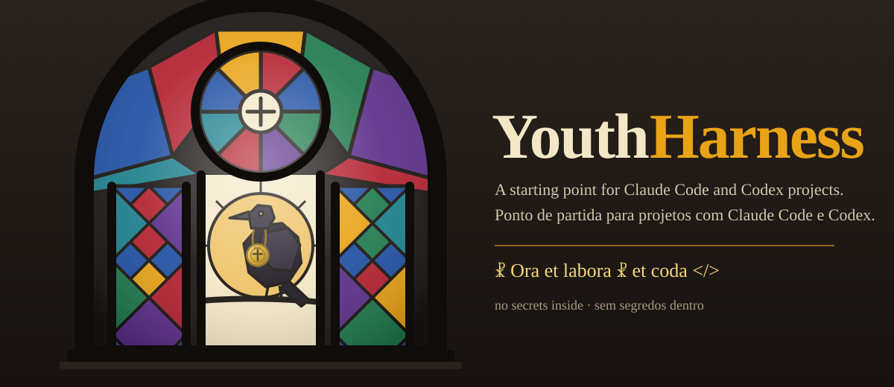

<p align="center">
  
</p>

<p align="center">
  <a href="#português">Português</a> · <a href="#english">English</a>
</p>

<a id="português"></a>

# YoungCrowHarness

Um ponto de partida para projetos feitos com Claude Code e Codex. Você clona, roda um comando, e o
projeto novo já nasce com as regras da casa, os hooks, os atalhos de MCP e as skills que valem a pena.
Não tem segredo nenhum aqui dentro: tudo o que é senha, token ou chave fica no `.env` local, que o
`.gitignore` já protege.

O corvo do vitral é o mascote. Ele carrega uma medalha de São Bento e o lema está na assinatura, no fim
desta página.

## Começar em um comando

```bash
git clone https://github.com/Matheusrpc/YoungCrowHarness.git
bash YoungCrowHarness/setup.sh meu-projeto --nome "Meu Projeto"
```

O `setup.sh` faz quatro coisas. Copia o harness para a pasta do projeto sem sobrescrever o que já
existe. Cria um `.env` local a partir do `.env.example`, com permissão 600, para você preencher à mão.
Instala a skill `humanizer` do upstream (commit pinado) e a `humanizer-ptbr` em `~/.claude/skills/`. E,
se o Claude Code estiver instalado, adiciona os marketplaces e instala os plugins listados em
`skills-lock.json`. Rode com `--sem-plugins` para pular essa última parte, ou com `--force` para trocar
arquivos que já existem.

Depois disso, abra o `CLAUDE.md` e troque cada `<preencher>` pelo que é seu: comandos de teste, alvos de
publicação, fronteiras. Abra o `.mcp.json` e coloque as URLs dos seus servidores. Aí é só rodar
`claude` dentro da pasta.

## O que vem dentro

| Arquivo | Para que serve |
|---|---|
| `CLAUDE.md` | O guia que o Claude Code lê no início de cada sessão: dez leis de trabalho, alvos de publicação, comandos e fronteiras. Em português. |
| `docs/CLAUDE.en.md` | O mesmo guia em inglês, para quem trabalha na outra língua. Fique com um dos dois. |
| `AGENTS.md` | A entrada do Codex: lê o `CLAUDE.md` primeiro, um executor escreve por vez, revisores só leem, e o navegador fecha ao terminar. |
| `.claude/settings.json` | Hooks do Claude Code. Chamam o detector de design do plugin `impeccable` depois de cada edição, só se ele estiver instalado. |
| `.codex/hooks.json` | Os mesmos hooks, no formato do Codex. |
| `.mcp.json` | Atalhos de MCP com URLs de exemplo. Nunca ponha token aqui; o token vai por variável de ambiente. |
| `.env.example` | Os nomes das variáveis que o projeto espera, com valores falsos. O `.env` real nasce daqui e nunca entra no git. |
| `.gitignore` | Segredos, caches, evidência pesada e estado local fora do repositório. |
| `skills-lock.json` | O retrato dos plugins e skills que o harness usa, com marketplace, versão e commit, para outra máquina reproduzir. |
| `skills/humanizer-ptbr/` | Juiz de texto em português: 25 padrões de escrita de máquina e como reescrever. Companheiro do `humanizer` em inglês. |
| `setup.sh` | O comando que monta tudo. |

## As dez leis, em uma frase cada

Medir antes de afirmar. Nenhum segredo em arquivo versionado. Escrever só dentro do repositório e nos
alvos declarados. Divergiu do combinado, parar e reportar. Idempotência antes de qualquer fornecedor
pago. Estado persistido, nunca execução suspensa. Mudança de regra nasce ligada, com corrida de prova.
Publicação imediata, com placar de atraso no fim de todo relatório. Uma frente por vez no checkout,
paralelismo só com worktree. Navegador fecha ao terminar, com `pgrep` em zero.

O texto completo, com o porquê de cada uma, está no `CLAUDE.md`.

## O que não está aqui

Nenhuma senha, token, chave de API, IP, nome de máquina ou dado de cliente. O harness é a forma de
trabalhar, não o trabalho. As skills de terceiros não estão copiadas: o `setup.sh` instala do upstream,
com a licença e o commit de cada uma. Os plugins do `skills-lock.json` que vêm de diretório local (o
`impeccable`) você instala à mão, seguindo a página do próprio plugin.

## Créditos

A skill `humanizer` é de [blader/humanizer](https://github.com/blader/humanizer), MIT, e os padrões
vêm de [«Signs of AI writing»](https://en.wikipedia.org/wiki/Wikipedia:Signs_of_AI_writing) da
Wikipédia. Os plugins listados no `skills-lock.json` pertencem aos seus autores. O resto deste
repositório é MIT.

---

<a id="english"></a>

# YoungCrowHarness

A starting point for projects built with Claude Code and Codex. Clone it, run one command, and the new
project starts with the house rules, the hooks, the MCP shortcuts and the skills that earn their place.
There is no secret inside: every password, token or key lives in a local `.env`, which the `.gitignore`
already protects.

The crow in the stained glass is the mascot. It wears a Saint Benedict medal, and the motto is in the
signature at the end of this page.

## Start with one command

```bash
git clone https://github.com/Matheusrpc/YoungCrowHarness.git
bash YoungCrowHarness/setup.sh my-project --name "My Project"
```

`setup.sh` does four things. It copies the harness into the project folder without overwriting what is
already there. It creates a local `.env` from `.env.example`, with permission 600, for you to fill in
by hand. It installs the `humanizer` skill from upstream (pinned commit) and `humanizer-ptbr` into
`~/.claude/skills/`. And, if Claude Code is installed, it adds the marketplaces and installs the plugins
listed in `skills-lock.json`. Run it with `--no-plugins` to skip that last part, or with `--force` to
replace files that already exist.

After that, open `CLAUDE.md` and replace each `<preencher>` (fill in) with what is yours: test commands,
publication targets, boundaries. If you work in English, move `docs/CLAUDE.en.md` over `CLAUDE.md`.
Open `.mcp.json` and put in the URLs of your servers. Then run `claude` inside the folder.

## What is inside

| File | What it is for |
|---|---|
| `CLAUDE.md` | The guide Claude Code reads at the start of every session: ten working laws, publication targets, commands and boundaries. In Portuguese. |
| `docs/CLAUDE.en.md` | The same guide in English. Keep one of the two. |
| `AGENTS.md` | The Codex entry point: read `CLAUDE.md` first, one writer at a time, reviewers only read, and the browser closes when the task ends. |
| `.claude/settings.json` | Claude Code hooks. They call the `impeccable` plugin's design detector after each edit, only if it is installed. |
| `.codex/hooks.json` | The same hooks, in Codex format. |
| `.mcp.json` | MCP shortcuts with example URLs. Never put a token here; tokens travel through environment variables. |
| `.env.example` | The names of the variables the project expects, with fake values. The real `.env` is born from it and never enters git. |
| `.gitignore` | Secrets, caches, heavy evidence and local state stay out of the repository. |
| `skills-lock.json` | A snapshot of the plugins and skills the harness uses, with marketplace, version and commit, so another machine can reproduce it. |
| `skills/humanizer-ptbr/` | A text judge for Brazilian Portuguese: 25 patterns of machine writing and how to rewrite them. Companion to the English `humanizer`. |
| `setup.sh` | The command that puts it all together. |

## The ten laws, one sentence each

Measure before you claim. No secret in a versioned file. Write only inside the repository and the
declared targets. If something differs from the plan, stop and report. Idempotency before any paid
provider. Persisted state, never a suspended run. A rule change is born switched on, with a proof run.
Publish immediately, with a delay scoreboard at the end of every report. One piece of work at a time in
the checkout, parallel work only through worktrees. The browser closes when the task ends, with `pgrep`
at zero.

The full text, with the reason behind each law, is in `CLAUDE.md` and `docs/CLAUDE.en.md`.

## What is not here

No password, token, API key, IP address, hostname or customer data. The harness is the way of working,
not the work. Third party skills are not copied: `setup.sh` installs them from upstream, with each one's
license and commit. Plugins in `skills-lock.json` that come from a local directory (`impeccable`) you
install by hand, following the plugin's own page.

## Credits

The `humanizer` skill is [blader/humanizer](https://github.com/blader/humanizer), MIT, and its patterns
come from Wikipedia's [«Signs of AI writing»](https://en.wikipedia.org/wiki/Wikipedia:Signs_of_AI_writing).
The plugins listed in `skills-lock.json` belong to their authors. The rest of this repository is MIT.

---

<p align="center"><b>☧ Ora et labora ☧ et coda &lt;/&gt;</b></p>
