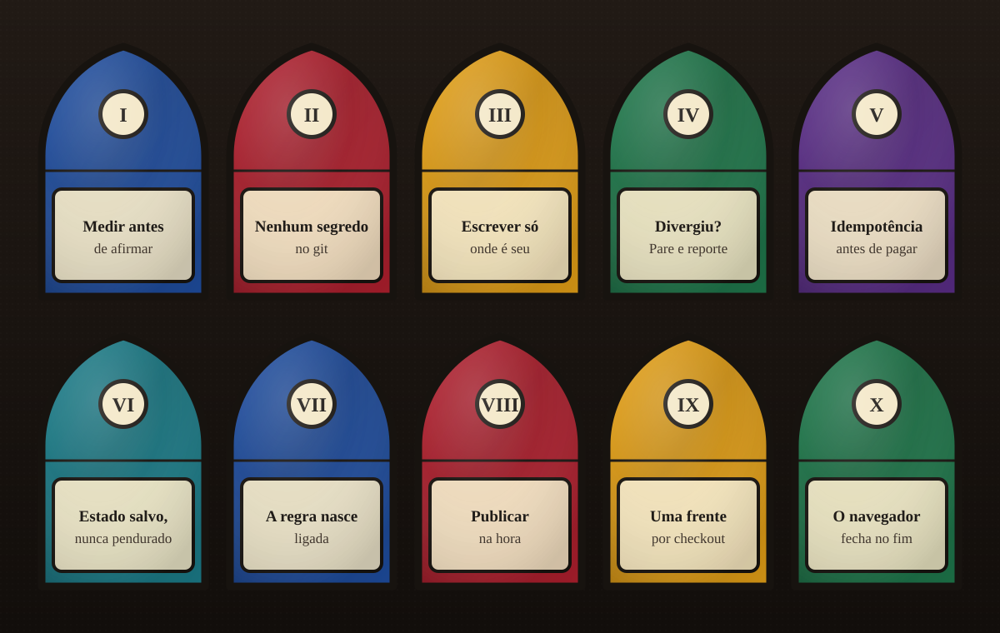

<p align="center">
  
</p>

<p align="center">
  
</p>

<p align="center">
  
  
  
  
</p>

<p align="center">
  <a href="#português"></a>
  <a href="#english"></a>
</p>


<a id="português"></a>

##  O que é

Um ponto de partida para projetos feitos com Claude Code e Codex. Você clona, roda um comando, e o
projeto novo já nasce com as regras da casa, os hooks, os atalhos de MCP e as skills que valem a pena.
Senhas, tokens e chaves devem ficar no ambiente local. O instalador protege o `.env` com uma regra
de ignore e recusa um `.env` já rastreado; revise também os demais arquivos antes de versionar.

O corvo do vitral é o mascote. Ele carrega uma medalha de São Bento, e o lema está na assinatura, no
fim desta página.

O desenho da próxima evolução está na [especificação da fundação](docs/superpowers/specs/2026-10-01-youngcrow-foundation-design.md),
aprovada para implementação por etapas. Esta entrega corrige o instalador e documenta a adoção manual.
O vault com índices, personalizer, auditoria automática e integrações de memória ainda estão planejados.

##  Começar em um comando

```bash
git clone https://github.com/Matheusrpc/YoungCrowHarness.git
bash YoungCrowHarness/setup.sh meu-projeto --client both --nome "Meu Projeto"
```

**Passo a passo:** [repo do zero](docs/USAGE.md#zero-pt) · [migrar repo existente](docs/USAGE.md#migrar-pt) · [como operar](docs/USAGE.md#operar-pt).

Requer Bash, Git e `python3` funcionando no mesmo terminal. No Windows, use Git Bash.
O `setup.sh` copia o harness preservando os arquivos existentes e acrescenta proteção ao `.gitignore`.
Cria um `.env` local a partir do `.env.example`, com permissão 600 onde suportada, para você preencher à mão.
Instala a skill `humanizer` do upstream (commit pinado) e a `humanizer-ptbr`: em `~/.claude/skills/` para Claude
e `.agents/skills/` no projeto para Codex. Use `--client claude`, `--client codex` ou `--client both` (padrão). E,
se o Claude Code estiver instalado, adiciona os marketplaces e instala os plugins listados em
`skills-lock.json`. Rode com `--sem-plugins` para pular essa última parte, ou com `--force` para trocar
os templates que já existem. `.env` e as regras existentes de `.gitignore` são preservados mesmo com force.
As skills dos clientes selecionados continuam com `--sem-plugins`; as do Claude afetam o usuário.
O modo Codex não chama o Claude. Plugins do Codex são instalados pelo catálogo do próprio cliente.
Humanizer divergente ou modificado é preservado e interrompe o setup; falhas de instalação retornam código não zero.
O guia explica como retomar e quais componentes exigem instalação manual.

Depois disso, abra o `CLAUDE.md` e troque cada `<preencher>` pelo que é seu: comandos de teste, alvos de
publicação, fronteiras. Configure MCPs em `.mcp.json` para Claude e `.codex/config.toml` para Codex.
Abra o cliente na pasta e [confira skills, MCPs e hooks](docs/USAGE.md#clientes-pt).

##  O que vem dentro

| Arquivo | Para que serve |
|---|---|
| `CLAUDE.md` | O guia que o Claude Code lê no início de cada sessão: dez leis de trabalho, alvos de publicação, comandos e fronteiras. Em português. |
| `docs/CLAUDE.en.md` | O mesmo guia em inglês. Fique com um dos dois. |
| `AGENTS.md` | A entrada do Codex: lê o `CLAUDE.md` primeiro, um executor escreve por vez, revisores só leem, e o navegador fecha ao terminar. |
| `.claude/settings.json` | Hooks do Claude Code. Chamam o detector de design do plugin `impeccable` depois de cada edição, só se ele estiver instalado. |
| `.codex/hooks.json` | Os mesmos hooks, no formato do Codex. |
| `.codex/config.toml` | MCPs do Codex no escopo do projeto. Exemplos desativados até revisão; exige confiança do projeto. |
| `.mcp.json` | Atalhos de MCP com URLs de exemplo. Nunca ponha token aqui; o token vai por variável de ambiente. |
| `.env.example` | Os nomes das variáveis que o projeto espera, com valores falsos. O `.env` real nasce daqui e nunca entra no git. |
| `.gitignore` | Segredos, caches, evidência pesada e estado local fora do repositório. |
| `skills-lock.json` | Inventário dos plugins e origem das skills. O instalador verifica o commit de humanizer; versões dos plugins de marketplace ainda não são fixadas por este manifesto. |
| `skills/humanizer-ptbr/` | Juiz de texto em português: 25 padrões de escrita de máquina e como reescrever. |
| `setup.sh` | O comando que monta tudo. |

##  As dez leis

<p align="center">
  
</p>

O texto completo, com o porquê de cada uma, está no `CLAUDE.md`.

##  O que não está aqui

Use exemplos públicos; mantenha credenciais e dados de clientes fora dos arquivos versionados.
As skills de terceiros não estão copiadas: o `setup.sh` instala do upstream,
com a licença e o commit de cada uma. Os plugins do `skills-lock.json` que vêm de diretório local (o
`impeccable`) você instala à mão, seguindo a página do próprio plugin.

##  Créditos

A skill `humanizer` é de [blader/humanizer](https://github.com/blader/humanizer), MIT, e os padrões
vêm de [«Signs of AI writing»](https://en.wikipedia.org/wiki/Wikipedia:Signs_of_AI_writing) da
Wikipédia. Os plugins listados no `skills-lock.json` pertencem aos seus autores. O resto deste
repositório é MIT.


<a id="english"></a>

##  What it is

A starting point for projects built with Claude Code and Codex. Clone it, run one command, and the new
project starts with the house rules, the hooks, the MCP shortcuts and the skills that earn their place.
Passwords, tokens and keys belong in the local environment. Setup protects `.env` with an ignore rule
and rejects a tracked `.env`; review other files before committing them as well.

The crow in the stained glass is the mascot. It wears a Saint Benedict medal, and the motto is in the
signature at the end of this page.

The next version is described in the [foundation specification](docs/superpowers/specs/2026-10-01-youngcrow-foundation-design.md)
(Portuguese, approved for staged implementation). This delivery fixes setup and documents manual adoption.
The indexed vault, personalizer, automated audit and memory integrations remain planned.

##  Start with one command

```bash
git clone https://github.com/Matheusrpc/YoungCrowHarness.git
bash YoungCrowHarness/setup.sh my-project --client both --name "My Project"
```

**Step by step:** [new repository](docs/USAGE.md#new-en) · [adopt an existing repo](docs/USAGE.md#migrate-en) · [daily operation](docs/USAGE.md#operate-en).

Requires Bash, Git and a working `python3` in the same terminal. On Windows, use Git Bash.
`setup.sh` preserves existing project files and appends protection to `.gitignore`.
It creates a local `.env` from `.env.example`, with permission 600 where supported, for you to fill in
by hand. It installs the `humanizer` skill from upstream (pinned commit) and `humanizer-ptbr` into
`~/.claude/skills/` for Claude and project-local `.agents/skills/` for Codex. Choose `--client claude`,
`--client codex` or `--client both` (default). For Claude, it adds the marketplaces and installs the plugins
listed in `skills-lock.json`. Run it with `--no-plugins` to skip that last part, or with `--force` to
replace existing templates. `.env` and existing ignore rules are preserved even with force.
Selected clients' skills still install with `--no-plugins`; Claude installations affect the user.
Codex-only mode does not call Claude. Install Codex plugins through its own catalog.
A dirty or mismatched humanizer is preserved and blocks setup; installation failures return nonzero.
The guide explains recovery and manual components.

After that, open `CLAUDE.md` and replace each `<preencher>` (fill in) with what is yours: test commands,
publication targets, boundaries. If you work in English, move `docs/CLAUDE.en.md` over `CLAUDE.md`.
Configure `.mcp.json` for Claude and `.codex/config.toml` for Codex. Open your client inside the folder
and check loaded skills, MCPs and hooks using the [usage guide](docs/USAGE.md#english).

##  What is inside

| File | What it is for |
|---|---|
| `CLAUDE.md` | The guide Claude Code reads at the start of every session: ten working laws, publication targets, commands and boundaries. In Portuguese. |
| `docs/CLAUDE.en.md` | The same guide in English. Keep one of the two. |
| `AGENTS.md` | The Codex entry point: read `CLAUDE.md` first, one writer at a time, reviewers only read, and the browser closes when the task ends. |
| `.claude/settings.json` | Claude Code hooks. They call the `impeccable` plugin's design detector after each edit, only if it is installed. |
| `.codex/hooks.json` | The same hooks, in Codex format. |
| `.codex/config.toml` | Project-scoped Codex MCP servers. Examples start disabled for review; project trust is required. |
| `.mcp.json` | MCP shortcuts with example URLs. Never put a token here; tokens travel through environment variables. |
| `.env.example` | The names of the variables the project expects, with fake values. The real `.env` is born from it and never enters git. |
| `.gitignore` | Secrets, caches, heavy evidence and local state stay out of the repository. |
| `skills-lock.json` | Plugin inventory and skill sources. The installer verifies the humanizer commit; this manifest does not yet pin marketplace plugin versions. |
| `skills/humanizer-ptbr/` | A text judge for Brazilian Portuguese: 25 patterns of machine writing and how to rewrite them. |
| `setup.sh` | The command that puts it all together. |

##  The ten laws

<p align="center">
  
</p>

The full text, with the reason behind each law, is in `docs/CLAUDE.en.md`.

##  What is not here

Use public examples; keep credentials and customer data out of tracked files.
Third party skills are not copied: `setup.sh` installs them from upstream, with each one's
license and commit. Plugins in `skills-lock.json` that come from a local directory (`impeccable`) you
install by hand, following the plugin's own page.

##  Credits

The `humanizer` skill is [blader/humanizer](https://github.com/blader/humanizer), MIT, and its patterns
come from Wikipedia's [«Signs of AI writing»](https://en.wikipedia.org/wiki/Wikipedia:Signs_of_AI_writing).
The plugins listed in `skills-lock.json` belong to their authors. The rest of this repository is MIT.

<a id="verificacao"></a>
<a id="verification"></a>

##  Verificação / Verification

```bash
python3 -m unittest discover -s tests -v  # Python 3.11+
bash -n setup.sh
```

| Ambiente / Environment | Evidência / Evidence |
|---|---|
| Windows + Git Bash + Python 3.14 | Suíte local verificada; dois casos de symlink pulados por falta de privilégio / local suite verified; two symlink cases skipped for missing privilege. |
| Linux | Suíte automática a cada push/PR, incluindo symlinks / automated suite on every push/PR, including symlinks — [execuções / runs](https://github.com/Matheusrpc/YoungCrowHarness/actions). |
| macOS / PowerShell nativo | Não verificados / not verified. Use Bash. |

Os casos pulados no Windows são `test_dangling_env_link_is_rejected` e `test_directory_link_cannot_write_outside_project`.
Devem executar no Linux. A suíte usa Git local, um usuário temporário e chamadas de plugins simuladas.
Ela não comprova execução real de plugins ou acesso a MCPs. Execute um setup por destino de cada vez.
O teste opcional [smoke_clients.py](tests/smoke_clients.py) verifica a descoberta no Codex e a configuração MCP no Claude,
sem chamadas de modelo. Confira o [guia dos clientes](docs/USAGE.md#clientes-pt) para confiança e ativação.

The two named symlink cases must run on Linux. Tests use local Git, a temporary home and simulated plugin calls.
They do not execute real plugins or access MCP servers. The optional client smoke check verifies Codex discovery
and Claude MCP configuration without model calls. Run one setup per target at a time.

<p align="center">
  
</p>
