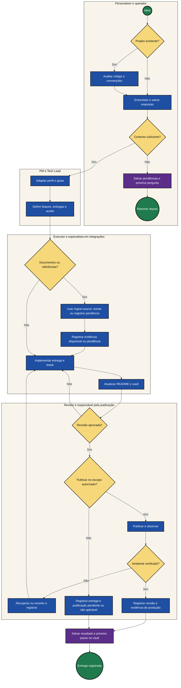
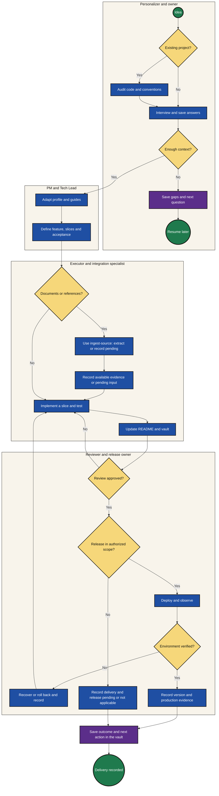

# Processo completo / Complete process

[← README](../README.md#processo-pt) · [Guia de uso / Usage](USAGE.md) · [English](#english)

Os diagramas visíveis no README mostram cinco caminhos: projeto novo, adoção, operação, ingestão de fontes e retomada da memória.
Este fluxo detalha as decisões de descoberta, revisão e publicação, incluindo pausas e recuperação.
Os círculos representam eventos; as caixas, tarefas; os losangos, decisões. É uma documentação
inspirada em BPMN. Pessoas e agentes executam o rito; PM e Tech Lead são responsabilidades.

Uma entrevista pausada retoma pelo índice de produto. Cada entrega registra capacidades usadas,
testes, revisão e próximo passo; produção exige evidência do ambiente. Quando a publicação não faz
parte do escopo, registre “não aplicável”; quando falta autorização, registre a pendência.

Fontes inacessíveis bloqueiam apenas o trabalho que depende delas. Fontes e relações privadas ficam
no índice local; compartilhá-las exige uma cópia revisada e aprovação do digest exato. A conversão
usa estado persistido e limites; o hook só registra referências. Veja o [fluxo de fontes](../assets/process-sources-pt.svg)
e o [guia de operação](USAGE.md#fontes-pt).

A [retomada pela memória](../assets/process-memory-pt.svg) começa com notas salvas e selecionadas.
O retrato só é ativado após validação. A consulta confere revisões; índice ausente, antigo ou com falha
leva ao Markdown atual. O agente abre as evidências antes de registrar decisões e próxima ação.
Graphify processa o grafo local; a interpretação usa a IA da sessão. Publicação continua exigindo
seu próprio registro de evidência. Veja os [comandos](USAGE.md#memoria-pt).

The README diagrams cover five paths: a new project, adoption, daily work, source intake and memory retrieval.
This detailed flow includes discovery, review and release decisions, pauses and recovery.
Circles are events, boxes are tasks and diamonds are decisions. This is BPMN-inspired documentation.
People and agents carry out the process; PM and Tech Lead are responsibilities.

Resume a paused interview through the product index. Each delivery records capabilities used,
tests, review and the next action; production requires environment evidence. Record release as
“not applicable” when outside scope, or pending when authorization is missing.

Inaccessible sources block only dependent work. Private sources and relations stay under the local
index. Sharing them requires a reviewed copy and approval of its exact digest. Conversion uses
persisted state and limits; the hook only records references. See the [source flow](../assets/process-sources-en.svg)
and [operating guide](USAGE.md#sources-en).

Os SVGs editáveis em `assets/process-*.svg` são as versões visuais do README. Ao mudar o rito,
atualize os diagramas PT/EN, este fluxo e o guia de uso. Preserve a paleta e confira a legibilidade.
The editable SVGs in `assets/process-*.svg` supply the README visuals. Process changes must update
both languages, this flow and the usage guide. Preserve the palette and check readability.

[Memory retrieval](../assets/process-memory-en.svg) starts with saved, selected notes. A snapshot is activated only after validation. Queries check revisions; missing, stale or failed indices fall back to current Markdown. The agent opens evidence before recording decisions and the next action. Graphify processes the local graph; the session AI interprets it. Publication still requires its own evidence. See the [commands](USAGE.md#memory-en).
