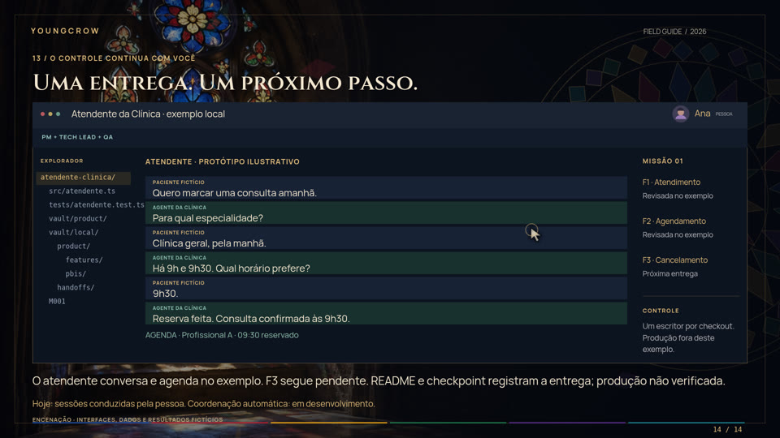

# YoungCrow: da ideia à primeira missão

Frente: tutorial audiovisual. Roteiro da prévia de desenvolvimento de 8 de outubro de 2026.

Dois capítulos, 25 cenas e 298 segundos, com lettering em português e elementos de vitral animados com Three.js.
O tutorial original de 118 segundos permanece inteiro; o caso prático acrescenta 180 segundos ao final.
O formato horizontal usa 1920 × 1080; o vertical recompõe os mesmos elementos em 1080 × 1920,
com o corvo na faixa superior, texto maior e comandos dos clientes empilhados.
A arte original de [`assets/vitral.png`](../../../assets/vitral.png), com o corvo e a medalha
de São Bento, permanece intacta. A animação usa sua composição, cores e tipografia de apoio.



O tutorial ensina a preparação disponível na branch `feat/isolated-executor`, PR #24.
PM e Tech Lead atuam na sessão atual. `prepared` significa missão preparada: o filme não
apresenta executor autônomo, fila ou deploy como funcionalidades concluídas.
Os comandos na tela são texto; a apresentação não os executa.

No segundo capítulo, Ana conduz um exemplo fictício de agente de atendimento para clínica médica. As telas
ilustram terminal, Codex, Claude, editor, features e vault. O checkpoint é salvo antes da
interrupção por cota; Ana encerra o Codex e abre o Claude na mesma pasta. A retomada usa arquivos,
índices e o diff. F3, cancelamento, permanece no backlog. Interfaces, código e resultados são
encenados, com aviso na tela; nenhuma sessão de modelo foi executada para produzir o vídeo.

Magnific não estava disponível no ambiente de criação. A arte vem do repositório,
sem geração ou ampliação atribuída a esse serviço. A trilha dos MP4 é uma composição
instrumental procedural original, sem samples externos e sem locução.

## Assistir à apresentação

Na raiz do repositório:

```bash
python3 -m http.server 8000 --bind 127.0.0.1
```

Abra `/docs/media/youngcrow-guide/index.html` nesse servidor local. Use Reproduzir,
a barra de tempo e o seletor 16:9 / 9:16. Espaço controla a reprodução; as setas mudam
de cena quando o foco não está em um controle. A apresentação começa pausada e é silenciosa.
O HTML gerado incorpora imagens, fontes e scripts. A reprodução foi verificada via
servidor local, sem requisições externas; o navegador deste ambiente bloqueia navegação `file://`.

## Renderizar os dois vídeos

O renderizador requer Python 3, Playwright para Python, NumPy, Chromium em
`/usr/bin/chromium`, FFmpeg e ffprobe. As dependências de render são opcionais e não fazem
parte do setup do harness. O navegador precisa oferecer WebGL; o render usa SwiftShader.
Três fontes WOFF2 e Three.js 0.158.0 estão em `vendor/`, com suas licenças, sem CDN em execução.

```bash
python3 -B docs/media/youngcrow-guide/render.py \
  --preview --out .runtime/youngcrow-film/output
python3 -B docs/media/youngcrow-guide/render.py \
  --out .runtime/youngcrow-film/output
```

`--preview` captura as 25 cenas nos dois formatos e verifica erros JavaScript e o limite
inferior do conteúdo. O segundo comando renderiza quadros determinísticos a 24 fps,
compõe a trilha e exporta H.264/AAC. Para apenas um formato, use `--format landscape`
ou `--format portrait`.

Para trabalhar em apenas um capítulo, acrescente `--chapter intro` ou `--chapter demo`.
Use diretórios de saída diferentes para preservar os arquivos já entregues. Para preservar os MP4 originais, confira seus hashes, renderize o segundo capítulo em outro
diretório e una os capítulos por cópia do vídeo, sem reencodar os primeiros 118 segundos de imagem.
Una os WAV originais e codifique a trilha completa em AAC para manter a continuidade do áudio.

Arquivos gerados: `YoungCrow-16x9.mp4`, `YoungCrow-9x16.mp4`,
`YoungCrow-apresentacao.html`, `YoungCrow-trilha-original.wav` e `render-evidence.json`.
Capturas, vídeos e recibos ficam fora do Git. O script fecha suas páginas, navegador e
servidor local em `finally`; não abre clientes de IA nem altera projetos consumidores.

## Roteiro e transcrição

### Capítulo 1: começar com o YoungCrow

| Tempo | Cena | Ação |
|---|---|---|
| 00:00 | YoungCrow | Da ideia à primeira missão; contexto para continuar |
| 00:07 | Prepare o espaço | Bash, Git e Python 3; clone do harness ao lado do produto |
| 00:18 | Projeto novo | Setup com trial, recuperação, Git e proteção do `.env` |
| 00:33 | Projeto existente | Branch de adoção, preservação e testes existentes |
| 00:48 | Abra o cliente | Regras, permissões, confiança, skills, hooks e MCPs |
| 00:59 | Personalize | Produto, decisões e perguntas com `yc-personalizer` |
| 01:09 | Configure | Modelos, esforço e limites com `yc-config` |
| 01:18 | Prepare a missão | Objetivo, tarefas e aceite com `yc-missao` |
| 01:30 | Consulte o estado | Preparação e bloqueios com `yc-status` |
| 01:38 | Continue em outra sessão | Vault, evidências e `retrieve-memory` |
| 01:48 | Escopo atual | Preparação disponível; automação ainda em desenvolvimento |

Baixe a prévia do harness a partir de uma pasta fora do seu projeto:

```bash
git clone \
  --branch feat/isolated-executor \
  https://github.com/Matheusrpc/YoungCrowHarness.git
```

Para um projeto novo, nessa mesma pasta:

```bash
bash YoungCrowHarness/setup.sh meu-projeto \
  --trial --client both --nome "Meu Projeto"
cd meu-projeto
git init
git check-ignore --no-index .env
git ls-files -- .env
```

Guarde o caminho de recuperação mostrado pelo setup. O primeiro check deve mostrar
`.env`; o último deve ficar vazio. O trial pula plugins e downloads de skills.

Para um projeto existente, salve o trabalho atual, encerre seus escritores e execute
da raiz do produto, com o clone do harness em uma pasta irmã:

```bash
git status --short
git switch -c chore/adotar-youngcrow
git ls-files -- .env
```

Se `.env` estiver rastreado, resolva isso antes do setup. Depois:

```bash
bash ../YoungCrowHarness/setup.sh . \
  --trial --client both --nome "Meu Produto"
```

Revise os arquivos novos e mantidos, compare as configurações e rode os testes existentes.
Não use `--force` como substituto da revisão. Consulte as condições do trial no
[guia de uso](../../USAGE.md#adocao-reversivel-pt), incluindo destino e ponto de retorno.

Abra o produto no cliente, preencha `CLAUDE.md` e `AGENTS.md` e confira as capacidades:

| Passo | Claude Code | Codex |
|---|---|---|
| Definir o produto | `/yc-personalizer` | `$yc-personalizer` ou seletor de skills |
| Registrar escolhas | `/yc-config` | `$yc-config` ou seletor de skills |
| Preparar a missão | `/yc-missao` | `$yc-missao` ou seletor de skills |
| Consultar | `/yc-status` | `$yc-status` ou seletor de skills |

Exemplo para personalização: “Quero criar uma agenda de atendimentos.” Para continuar:
“Use retrieve-memory para retomar esta feature.” Registre decisões, testes e a próxima
ação no vault. Encerre o escritor atual antes de abrir outra sessão no mesmo checkout.

### Capítulo 2: um atendente de clínica, do Codex ao Claude

| Tempo no vídeo completo | Cena | O que aparece na tela |
|---|---|---|
| 01:58 | Um projeto do zero | Ana apresenta um agente atendente com conversa e dados fictícios |
| 02:07 | Preparar o projeto | Terminal com setup, trial, Git e proteção do `.env` |
| 02:20 | Explicar o produto | `$yc-personalizer` e decisões registradas no perfil |
| 02:33 | PM define as features | Atendimento, agendamento sem conflito, cancelamento |
| 02:47 | Tech Lead detalha | PBIs, dependências e validação |
| 03:00 | O plano vira Markdown | Índices e trecho de uma nota de feature no vault |
| 03:12 | Preparar a missão | F1 + F2 selecionadas; F3 preservada; estado `prepared` |
| 03:26 | Codex implementa | Edição ilustrativa de código, testes e notas |
| 03:39 | Salvar antes do limite | Checkpoint com estado, decisões e próxima tarefa |
| 03:53 | Interromper e trocar | Cota esgotada na encenação, revisão do diff e encerramento do Codex |
| 04:07 | Claude recupera | Leitura dos índices, checkpoint e fontes atuais |
| 04:21 | Continuar a mesma PBI | Validação de sobreposição e teste correspondente |
| 04:34 | QA independente | Revisão somente leitura dos quatro casos de aceite |
| 04:47 | Continuidade | F1/F2 revisadas no exemplo; F3 pendente; produção não verificada |

A clínica e seus pacientes são fictícios. O plano ilustrado é:

- F1: entender o pedido de atendimento e encaminhar dúvidas clínicas para uma pessoa.
- F2: consultar disponibilidade, oferecer horários e confirmar a reserva sem conflitos. Permitir horários iguais para profissionais diferentes.
- F3: cancelar preservando o registro e liberar o horário. Esta feature não é implementada no exemplo.

A regra escolhida permite consultas consecutivas: uma termina às 10h e a próxima pode começar às 10h.
Os arquivos `src/atendente.ts` e `tests/atendente.test.ts` são parte do projeto fictício; não são gerados pelo setup.

Depois do clone apresentado no primeiro capítulo, Ana cria outro produto:

```bash
bash YoungCrowHarness/setup.sh atendente-clinica \
  --trial --client both --nome "Atendente da Clínica"
cd atendente-clinica
git init
git check-ignore --no-index .env
git ls-files -- .env
```

O percurso usa `vault/product/index.md` para o perfil. O backlog novo fica em
`vault/local/product/{epics,features,pbis}/<UUID>/index.md`. `<UUID>` é um marcador
visual; em um projeto real cada nota tem sua própria identidade e o contrato completo.
O editor do filme mostra trechos resumidos, não contratos prontos para importar.

Pedido de checkpoint, ainda com a sessão respondendo:

> Registre as mudanças, as decisões, os testes e a próxima tarefa no vault. Vou encerrar esta sessão.

Trecho ilustrado:

```md
# Atendente da clínica · checkpoint 01
Decisão: consultas consecutivas são permitidas.
Concluído: conversa e consulta de disponibilidade.
Em andamento: F2 · agendamento.
Falta: recusar conflito. F3 segue no backlog.
Arquivos: src/atendente.ts + tests/atendente.test.ts
Testes: consultar as evidências do exemplo.
Próxima ação: implementar e testar conflito.
Produção: não verificada.
```

Um checkpoint real também inclui UUIDs de projeto e nota, fontes e revisões verificadas,
branch/commit observado, diff ainda não commitado, comandos/resultados de testes e limites.
Escrever uma nota não comprova que os testes passaram. O filme não inventa hashes ou recibos reais.

Na encenação, a cota se esgota depois desse salvamento. O banner é ilustrativo e não reproduz
uma mensagem oficial. Não há contador de tokens real, detecção automática de cota ou transferência
automática de sessão. Se uma interrupção acontecer antes de salvar, retome do último registro
existente e confira os arquivos: o vault não recupera decisões que nunca foram escritas.

Ana consulta `git status --short` e `git diff`, encerra o Codex e abre `claude` na mesma pasta.
Na nova sessão, pede:

> Leia AGENTS.md e CLAUDE.md. Use retrieve-memory para retomar o atendente pelos índices do vault.
> Confira o checkpoint, as fontes atuais, git status e git diff antes de editar. Resuma a PBI
> em andamento, o backlog preservado e a próxima ação. Produção permanece fora deste pedido.

O Claude encontra o que foi registrado. A conversa anterior não é copiada e o contexto interno
do outro modelo não é transferido. Ana confirma o escopo antes de continuar a PBI.

Para QA, encerre a escrita da implementação e abra um contexto independente:

> Revise a PBI de agendamento, somente leitura. Compare o diff com os critérios e execute os
> testes declarados. Confira oferta de horários, confirmação da reserva, conflitos, consultas consecutivas e encaminhamento de dúvidas clínicas para uma pessoa. Registre defeitos e evidências; não corrija arquivos.

As verificações verdes do filme são resultados fictícios da encenação. A entrega real exige
saídas de testes, revisão e verificação do ambiente. O fechamento mantém F3 como próxima entrega.

## English overview

This 298-second Portuguese film preserves the original 118-second tutorial and appends
a 180-second illustrated clinic reception agent example, with conversation and appointment booking. The tutorial covers the development preview on
`feat/isolated-executor`: adoption, client setup, personalization, mission configuration,
preparation, status and memory. Autonomous execution and agent coordination are clearly
marked as under development. It does not run any displayed shell command.

The fictional operator uses Codex, records features and PBIs in Markdown, saves a checkpoint
before a simulated quota interruption, closes Codex, and opens Claude in the same project.
Claude reads the vault and current diff without receiving the old conversation. Development,
PM/Tech Lead decisions and independent QA are manually coordinated sessions. Interfaces,
patient data, code and test results are explicitly staged; no real model calls or clinical
deployment took place. Cancellation stays in the backlog, and production remains unverified.

The 1920 × 1080 and 1080 × 1920 exports use separate layouts. Three.js animates stained
glass geometry; Canvas renders lettering at full resolution. Original repository artwork
and bundled fonts load locally. Magnific was unavailable and was not used. MP4 exports
include an original procedural instrumental score, with no narration. The standalone HTML
includes its resources, playback controls and both layouts; it is silent and starts paused.

Use the commands above to render previews and videos. Rendering requires Python Playwright,
NumPy, Chromium, FFmpeg and WebGL. Runtime outputs are ignored by Git. Source and runtime
proof are separate from native YoungCrow executor acceptance.
