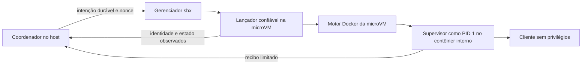

# Prova técnica do supervisor interno

Frente: executor isolado / 2A-R1. Ensaio autorizado, com provas parciais no Windows.

O supervisor em contêiner interno passou nos testes sintéticos abaixo. R1 continua
incompleto: o ensaio não implementa o protocolo do produto nem habilita Claude/Codex.
Resultados, identidades e hashes estão no [recibo sanitizado](../medicoes/supervisor-spike.json).

O objetivo continua sendo encerrar o trabalho do cliente no prazo mesmo se o
coordenador morrer. O [desenho aprovado](../superpowers/specs/2026-10-04-isolated-executor-design.md)
mantém as fronteiras do host, a reserva antes do efeito e a proibição de repetir
uma operação incerta. Este registro compara mecanismos e documenta a investigação;
não habilita um perfil de execução.

## Mecanismo candidato

O `sbx` inicia um lançador confiável dentro da microVM. Esse lançador prepara um
contêiner no motor Docker interno; o supervisor é PID 1 **nesse contêiner**. O
cliente de IA só poderá existir dentro dele, com usuário diferente do supervisor,
sem acesso ao motor Docker, aos arquivos do lançador ou ao canal de controle.

O fornecedor documenta um [motor Docker separado dentro da sandbox](https://docs.docker.com/ai/sandboxes/security/isolation/#docker-engine-isolation).
Isso oferece um caminho de investigação. Não comprova que o supervisor, o prazo
ou a autenticação funcionarão nessa composição.

| Alternativa | Avaliação neste incremento |
|---|---|
| EntryPoint direto do workload como PID 1 | Incompatível com o contrato sbx@1 já revisado |
| Supervisor no contêiner interno | Candidato escolhido para a prova: preserva o motor do fornecedor e a separação de usuários |
| Serviço próprio no host ou outro backend | Fora desta prova; ampliaria a arquitetura e a operação |

O lançador tem acesso ao motor interno para criar e observar o contêiner. Esse
privilégio não passa para o cliente. O produto precisaria de um workload v3 próprio;
o template oficial `shell-docker` serve apenas como preparação confiável do ensaio
descartável, sem cliente de IA ou mixin v3.

## Ordem de prova

1. Criar uma microVM sem workspace, com imagem fixada por digest, intenção e nonce
   gravados antes da criação. Confirmar identidade estável, política e ausência de
   compartilhamentos antes de qualquer fixture de ataque.
2. Confirmar que o motor interno permite criar o contêiner com raiz somente leitura,
   HOME privado gravável, 2 CPUs, 4 GiB, 64 PIDs, sem socket, capabilities do cliente,
   privilégios novos ou política de reinício automático. Inspecionar os valores aplicados.
3. Executar uma fixture de cinco segundos. O supervisor aceita uma inicialização e
   no máximo um despacho no mesmo prazo; uma mensagem repetida ou desconhecida encerra
   a operação. Código e estado de controle ficam fora da escrita do cliente.
4. Tentar descendentes, `setsid`, sinalização do supervisor, alteração do prazo,
   excesso de processos e de saída. Queda do coordenador ou perda do transporte não
   pode deixar trabalho ativo além do prazo. O observador fica fora da identidade
   do cliente e confirma ausência de descendentes.
5. Reiniciar o daemon e exercitar parada/retomada. Não reutilizar o prazo ou autorizar
   novo despacho a partir de um contêiner expirado. A hipótese de retomada exige
   medição própria; um temporizador em Python, sozinho, não comprova essa propriedade.
6. Só após a prova sem modelo, revisar OAuth, proxy e catálogo no contêiner interno.
   Nenhuma credencial real é copiada; as duas chamadas autenticadas continuam
   dependentes do aceite de R1/R2 e dos manifestos limitados.

Um sucesso parcial não fecha R1. A prova final ainda inclui rede, sentinelas fora do
pacote, credenciais fictícias, controle de saída e reconciliação por identidade,
conforme o plano original. A investigação não modifica os limites para obter sucesso.

## Observações no Windows

O setup inicial aplicou `deny-all` em uma instalação sem política nem sandboxes e
desabilitou `ssh.agentForwardingEnabled`. Após a recuperação descrita abaixo, a
consulta confirmou SSH desabilitado, login preservado e lista de sandboxes vazia.
Clipboard de imagens e remote control permaneceram desabilitados; não havia
servidores MCP registrados. O ensaio usa skills desabilitadas e nenhum workspace.

O reinício exigido pelo ajuste de SSH falhou por um endpoint antigo
`containerd.sock.ttrpc`, com erro Windows 1920. Uma tentativa de partida reproduziu
a falha. Renomear apenas o endpoint também falhou. Com o daemon parado e sem
processos do runtime, os dois diretórios envolvidos foram preservados temporariamente;
todos os itens normais voltaram aos caminhos originais, com ACL dos diretórios
preservada. Somente os dois endpoints inacessíveis ficaram em quarentena.
Não houve reset, exclusão de dados ou cópia de caches OAuth.

O serviço voltou, mas a criação da sandbox parou na preparação da imagem com erro
500. O log do daemon registrou falha ao conectar ao próprio `docker.sock`. O
[relato no repositório do Docker](https://github.com/docker/sbx-releases/issues/157)
descreve sintomas semelhantes em uma versão anterior; não prova que a causa seja a mesma.

Uma primeira chamada havia sido recusada na validação local do argumento `*`.
A CLI exigiu `**` para todos os hosts. A correção ocorreu após confirmar novamente
a lista vazia. A tentativa corrigida também terminou sem sandbox listada, sem
builder, execução interna ou chamada a modelo. O recibo privado conserva ambas.

O serviço foi parado e os novos endpoints inválidos foram isolados da mesma forma.
O operador iniciou o serviço pelo PowerShell normal; a criação de sandbox passou.
Um [relato no repositório do Claude Code](https://github.com/anthropics/claude-code/issues/76383)
associa sintomas semelhantes à origem do processo. A comparação local sustenta essa
hipótese, mas não isola sua causa. Não houve novo reinício do Windows nem alteração de driver.

O primeiro template fixado, `shell`, não continha o motor Docker. A VM foi parada,
preservando seu recibo. A variante `shell-docker`, fixada pelo digest Linux AMD64
`sha256:5bbe8539825fe1cace6dda2fb66919ef819324d905bea2795b8516aee0198222`,
expôs Docker Engine 29.8.1, inicialmente sem imagens ou contêineres.
O compilador Go já presente produziu a fixture estática; nenhum pacote foi baixado
dentro da VM. A imagem interna contém apenas esse binário e um arquivo de controle fictício.

Uma primeira criação do contêiner interno foi recusada na partida: o driver de log
não aceita compressão com um único arquivo. Desabilitar a compressão corrigiu a
configuração do ensaio. A tentativa sem partida permanece registrada e não conta
como prova de execução.

## Resultados observados

Host Windows 11 AMD64, build 26200; `sbx` 0.46.0. A CLI instalada também oferece
`inspect --json`, confirmado pela ajuda local. Sua consulta mostrou imagem por digest,
2 CPUs, 4 GiB, zero sessões e nenhum runtime mount. A política negou explicitamente
domínio externo, destino de modelo, loopback e endereço de metadata consultados.
Essas consultas de política não substituem testes de tráfego.

| Caso sintético | Resultado |
|---|---|
| Separação de usuários | Supervisor PID 1/UID 0; cliente UID/GID 1000, capabilities efetivas zeradas e `no_new_privs=1` |
| Sinalização e alteração | Cliente recebeu recusa ao sinalizar o supervisor, alterar binário/controle e ler o ambiente de PID 1; HOME privado continuou gravável |
| Descendentes com `setsid` | Dois descendentes observados antes; contêiner encerrou em 4,984 s, PID externo voltou a zero e nenhuma tarefa própria permaneceu em execução |
| Limite de processos | Cgroup mostrou 64 PIDs; novas criações receberam `resource temporarily unavailable`; encerramento em 4,924 s |
| Limite de saída | Detector encerrou após observar 8 MiB + 1 byte, em 0,146 s; payload descartado, sem retorno do conteúdo ao host |
| Prazo vencido | Reinício explícito do mesmo contêiner retornou 125 e registrou recusa; nenhum segundo cliente foi iniciado |
| Queda do coordenador e transporte | Ambos os processos de teste foram encerrados; supervisor atingiu o prazo sozinho, com um único cliente e zero tarefas próprias restantes |
| Parada da VM durante trabalho | `stop` confirmou a mesma identidade parada; ao iniciar o controle após expiração, o trabalho anterior continuou encerrado, sem novo despacho |
| Reinício do serviço pelo operador | As duas VMs preservaram identidade e estado parado; cinco contêineres executados conservaram um cliente cada, sem reinício automático |

O observador confiável usou estado do Docker, PID externo, `top` e inventário por
identidade. Isso mede o ciclo de vida do contêiner; não é uma varredura independente
de todos os namespaces do kernel. O ensaio não exerceu suspensão completa do host.

O contêiner interno não recebeu mounts do host, socket Docker, ambiente do lançador
ou rede (`network=none`). Os cgroups confirmaram 2 CPUs, 4 GiB e 64 PIDs. O cliente
mantinha SETUID/SETGID no bounding set; CapEff, CapPrm, CapAmb e CapInh estavam
zerados. A receita final ainda precisa revisar essa
diferença; o ensaio não certifica ausência de toda capability possível.

A microVM externa apresentou o gateway MCP do fornecedor e um registro `mcpgateway`.
Não havia servidores registrados. O ensaio interno não recebeu esse canal. Portanto,
“sem MCP no cliente” e “gateway ausente da VM” são condições distintas; a segunda
não foi atendida pelo template. Nenhum valor de segredo foi lido ou copiado.

O reinício do serviço foi feito com os trabalhos já encerrados. Ele comprovou
preservação e ausência de redisparo nesse estado; ainda falta repetir com trabalho ativo.
As duas VMs estão paradas, com os discos preservados para inspeção. O serviço iniciado
pelo operador permanece disponível. Nenhuma chamada a modelo foi feita.

## Estado e retomada

Continuação: o [protocolo em Python](2026-10-04-guardian-protocol.md) substitui a pendência
de despacho único abaixo e comprovou bounding set zerado. Os resultados deste relatório
permanecem vinculados à fixture descartável original; não certificam o código novo.

R1 incompleto. A fixture descartável confirma viabilidade parcial do contêiner interno.
Faltam o protocolo privado com despacho único e marcador durável, o workload v3,
a prova de rede permitida/proibida e sentinelas, a recuperação durante trabalho ativo,
a semântica de suspensão e a integração OAuth/catálogos. R2/R3 não começaram. Os testes
de adoção já aprovados continuam registrados no [relatório do diagnóstico](2026-10-04-isolated-executor.md).

Próxima ação: incorporar o lançador e o contêiner interno ao desenho de R1, implementar
o protocolo de inicialização/despacho e provar recusa de replay antes de integrar SQLite.
Conservar os requisitos pendentes como bloqueios de perfil. Preservar quarentenas e
recibos; não repetir login, instalação ou reset global.

## English overview

The disposable probe ran on Windows 11 with `sbx` 0.46.0 and a pinned `shell-docker`
template. A trusted launcher created a nested container with PID 1 supervision,
separate client UID, read-only root, private HOME, no network or host mounts, and
observed limits of 2 CPUs, 4 GiB and 64 PIDs. Descendants terminated within the
five-second window; process and output limits, coordinator/transport loss, expired
restart refusal and VM stop/restart passed their synthetic checks.

The operator restarted the daemon after workloads had stopped. VM identities and
single worker counts survived, with no automatic redispatch. Both VMs remain stopped.
Earlier agent-launched daemon attempts failed on Windows socket access; recovery
preserved normal state. Process origin remains a hypothesis, not an established root cause.

The outer VM exposes vendor MCP gateway metadata; the inner fixture received no
gateway access. Effective client capabilities were zero, but its bounding set retained
SETUID/SETGID under `no_new_privs`. No credentials or model calls were used.
Single-dispatch protocol, v3 packaging, network/sentinel tests, active daemon restart,
full suspension semantics and OAuth/catalog proof remain pending. R1 is incomplete;
R2/R3 have not started. See the [measurement](../medicoes/supervisor-spike.json).
