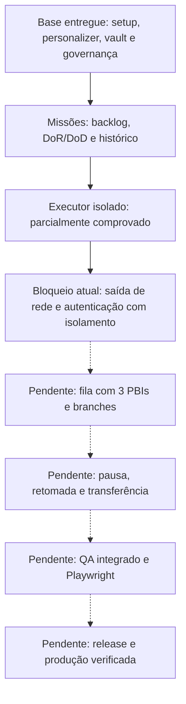

# Panorama do YoungCrow e dos ensaios do executor

**Atualização de 06/10, 21h50 (São Paulo):** a entrada corrigida foi executada e
parou em `sbx secret ls --json`, com código 1. Foram 25 consultas: proprietário,
configurações e políticas passaram; nenhuma ação de alteração foi iniciada.
`cleanup.restored=true`, sem erros. Não repetir nem reconciliar essa operação.
A consulta passou em duas verificações locais, uma com o auxiliar Windows original;
a mensagem da falha remota não foi capturada. A causa permanece desconhecida.
Próximo: obter o erro dessa consulta no contexto remoto, com diagnóstico somente
leitura, antes de preparar outro ensaio completo. A/B/A2 e o aceite de R1 continuam
pendentes. Os 102 testes anteriores verificaram preparação e respostas simuladas.

**Current checkpoint:** the corrected entry was consumed at 21:50 São Paulo time
on October 6. `sbx secret ls --json` exited 1 after ownership, settings and policy
checks passed. All 25 commands were reads; no mutation began. Cleanup is verified.
Do not replay or reconcile this operation. Two local inventory queries passed,
including one through the existing Windows helper, but the remote error message was
not retained. Its cause remains unknown. Next: capture only that read-only query's
error in the remote context before preparing another full probe. Native A/B/A2 and
R1 acceptance remain pending; the earlier 102 tests used simulated Docker replies.
Earlier next actions below are historical.

Frente: executor isolado / YC-203, com contexto do produto. Conferido em 2026-10-06 UTC.

A base de adoção, documentação e preparação de missões está entregue nos limites do
[backlog](../BACKLOG.md). O executor tem componentes implementados e provas reais parciais.
A esteira autônoma completa ainda não funciona de ponta a ponta. As entregas recentes
do executor estão nesta branch, sem publicação; os perfis nativos continuam bloqueados.

## Produto: o que já existe

| Capacidade | Estado e limite |
|---|---|
| Setup novo/migração e retorno do trial | Implementados e testados; serviços externos não são desfeitos pelo retorno dos arquivos |
| Personalizer | Entrevista retomável, auditoria e perfil; não substitui a execução dos agentes |
| Vault e integrações | Índices, referências, documentação de fornecedores e validação de notas |
| Docling | Ingestão local disponível; anexos sem caminho acessível ainda exigem registro explícito |
| Memória | Markdown consultável e Graphify opcional; claude-mem ainda planejado |
| Skills, agentes e MCPs | Catálogo, auditoria e provas delimitadas; configuração não concede autorização nem prova execução |
| Missões | Configuração, backlog, DoR/DoD e histórico; agentes de PM/TL não executam a esteira inteira automaticamente |
| Local ou dedicado | Seleção e documentação testadas em oito combinações; execução remota real ainda não certificada |

As evidências da base estão ligadas no [backlog](../BACKLOG.md#base-entregue).
O [setup local/dedicado](2026-10-05-execution-setup.md) tem oito adoções/restaurações
aprovadas e suíte com 403 aprovações e 11 skips. Isso não certifica um runner remoto.

## Executor: o que funcionou e o que não funcionou

| Experimento | Resultado | Consequência |
|---|---|---|
| Supervisor direto no entrypoint | Incompatível com o contrato do Docker | Proposta substituída por supervisor no contêiner interno |
| Supervisor interno e limites | Passou nos cenários sintéticos reais: privilégios, CPU/memória/PIDs, prazo, descendentes e queda do coordenador | Viabilidade parcial comprovada |
| Despacho único | Repetição e identidade inválida recusadas; controle protegido do cliente | Operação consumida não inicia outro cliente |
| Perda do coordenador/transporte | Processos terminaram; novo início recusado | Provas reais parciais de encerramento aprovadas |
| Build e criação do pacote | Tentativas iniciais falharam em builder, resolução, cache e HTTPS; criação por digest passou com `pull missing` | Sandbox criada com 2 CPUs/4 GiB, sem montagem do projeto; confiança temporária retirada |
| Prazo durante reinício | Primeira medição ultrapassou o prazo por cerca de 3,9 ms; reserva de encerramento passou com cerca de 994 ms de margem | Correção comprovada nesse cenário |
| Medição após reinício com rede | Observação após novo boot confundia o horário de término; observação anterior à inspeção comprovou parada antes do prazo | Recibo reprovado preservado; prova posterior separada |
| Acesso ao gateway MCP | Uma rota pelo proxy foi encontrada; saída direta restrita passou nos endereços testados | Bloqueio parcial comprovado; caminho autenticado completo pendente |
| Sentinelas no host e gateways | 124 tentativas TCP não conectaram nos alvos observados | Evidência delimitada, não cobertura de todos os caminhos possíveis |
| Credencial fictícia pelo proxy | Substituição por hostname funcionou; túneis por IP foram recusados | Caminho por IP não resolveu autenticação e isolamento juntos |
| Bloqueio por IP com hostname permitido | O destino continuou respondendo sob negação universal por IP | Candidato reprovado; aquela combinação de regras não impõe o controle esperado |
| Primeiro controlador de saída exclusiva | Falhas em leitura/comparação de settings e inventário; recuperação concluída | Erros de controle corrigidos; rede não comprovada |
| Operação v2 | Timeout antes do recibo operacional | Encerrada inconclusiva; causa histórica não comprovada |
| Prova observada | Exigia `override` ao gravar o padrão, mas Docker retorna `default` | Erro do nosso roteiro e da fixture; corrigido, restauração confirmada |
| Última prova corrigida | Fase A passou; B perdeu conexão sem evidência suficiente do bloqueio; A2 não executada | Inconclusiva, com limpeza confirmada; sem liberação do executor |

Fontes: [supervisor](2026-10-04-supervisor-spike.md),
[protocolo](2026-10-04-guardian-protocol.md), [launcher](2026-10-04-launcher-boundary.md),
[pacote](2026-10-04-native-package-proof.md), [prazo](2026-10-04-shutdown-reserve.md),
[rede integrada](2026-10-04-network-launcher.md), [sentinelas](2026-10-05-gateway-endpoints.md),
[proxy](2026-10-05-native-proxy-compatibility.md), [hostname/IP](2026-10-05-hostname-cidr-proof.md),
[ciclo exclusivo](2026-10-05-exclusive-egress-proof.md),
[erro de settings](2026-10-06-observed-egress-proof.md) e
[última operação](2026-10-06-corrected-egress-proof.md).

## Última operação em três etapas

| Etapa | Esperado | Observado | Aceite |
|---|---|---|---|
| A: controlador ligado | Requisição chega ao destino correto com credencial fictícia | HTTP 200, TLS verificado, credencial correspondente e peer registrado pelo guard | Passou |
| B: controlador desligado | Recusa atribuída ao upstream bloqueado, sem caminho alternativo | Túnel ao proxy e TLS estabelecidos; aplicação recebeu `RemoteDisconnected`; `upstream_refused=false` | Inconclusivo |
| A2: controlador religado | Repetir o controle positivo | Não executada porque B não teve aceite | Pendente |
| Limpeza | Retirar efeitos temporários | Configurações, política e inventário conferidos; cinco VMs paradas, porta fechada | Confirmada |

O `HTTP/1.1 200 OK` do CONNECT em B veio do proxy intermediário; não é resposta HTTP
da aplicação externa. Na análise inicial, a queda sozinha não permitia atribuir a causa. O diagnóstico posterior
encontrou a recusa explícita à porta do guard no log do daemon, na mesma sandbox e janela
de B. Nosso coletor não reconheceu essa evidência e preservou só hashes dos snapshots
de política. A2 continua não executada; o resultado completo permanece inconclusivo. Não haverá repetição automática ou relaxamento desse aceite.

Os 190 comandos registrados são consultas, preparação, execução e limpeza de uma única
operação. Não são 190 testes novos. Da mesma forma, as suítes de 390, 414 e 80 testes
se sobrepõem e não devem ser somadas como cobertura independente. Os 80 testes locais
da preparação passaram; a prova nativa posterior continua sem aceite de rede.

## O que falta

1. Executar uma vez a entrada nativa corrigida conforme o [guia](../USAGE.md#entrada-do-ensaio-integrado-somente-mantenedor).
   Preparação concluída com 102 testes; A/B/A2 e restauração reais ainda pendentes.
   A operação nova tem estado próprio e os recibos antigos permanecem consumidos.
   [Evidência da entrada](2026-10-06-integrated-egress-controller.md#entrada-nativa-corrigida-preparada).
2. Completar R1: rede/autenticação, isolamento do intermediário e MCP, pacote atualizado
   e suspensão do host. As provas atuais não certificam todas essas propriedades juntas.
3. R2: integrar o executor com reserva, recibos e recuperação das missões.
4. R3: provar Claude Code e Codex autenticados dentro do executor.
5. Implementar fila, branches, continuidade, QA e release; verificar o produto de ponta a ponta.

No estado atual não há limpeza pendente e não é necessário repetir `-Reconcile`.
A entrada da nova prova está preparada, com hashes e limites conferidos. O
[guia](../USAGE.md#entrada-do-ensaio-integrado-somente-mantenedor) contém o comando
para uma execução pelo mantenedor no PowerShell normal. A consulta preliminar excedeu
o prazo; a consulta isolada de status retornou daemon em execução. Nenhuma nova operação
nativa foi criada, e seu preflight ainda precisa passar.

## English overview

Adoption, documentation, memory and mission preparation form an implemented foundation.
The isolated executor has passed bounded process, privilege, deadline and package tests.
It has not passed end-to-end authenticated network isolation. Full autonomous delivery
is still pending, and recent executor work remains unpublished on this branch.

The latest native proof passed phase A: HTTP 200, matching dummy credential, verified TLS
and a recorded peer. With the guard absent, phase B ended with `RemoteDisconnected`,
without sufficient evidence attributing it to the intended refusal. A2 did not run.
Independent read-only checks confirmed restoration. No retry or reconciliation is needed.

Subsequent daemon-log analysis attributed B to guard connection refusal in the matching
sandbox and transport window. The collector missed this evidence; A2 remains unexecuted.
A separate collector passed eleven offline tests; controller integration was also validated
offline. The native entry is prepared, with 113 passing tests. Next: one maintainer run
from normal PowerShell; its preflight and native result remain pending. R1 completion,
mission adapter recovery, authenticated clients, priority queue, QA and release remain pending.

ATRASO: main 1
