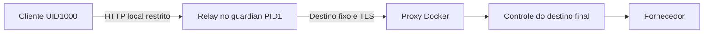
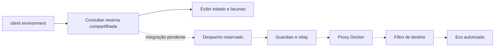

# Frente: executor isolado — consolidação

## Desenvolvimento

O [plano aprovado](../superpowers/plans/2026-10-07-executor-consolidation.md) mantém
Docker Sandboxes e exige Claude Code e Codex por assinatura. Implementação iniciada
pelo diagnóstico compartilhado; os PBIs de integração e aceite autenticado permanecem
pendentes. Nenhum perfil de execução foi liberado.

O preflight executado pelo Termius às 04:46 UTC confirmou a correção do armazenamento
remoto e capturou a falha seguinte: conjunto de credenciais indisponível para a sessão
Windows. O daemon respondeu. A execução parou em `secret ls --json`, antes de settings
ou qualquer mutação Docker. O erro agora recebe `credential_session_unavailable`.

O supervisor agora conserva stderr separado com o mesmo limite conjunto de bytes.
`mission_sbx` concentra consultas permitidas, identidade do executável, prazo, saída
limitada e classificação. `client environment --preflight` persiste intenções e saídas
privadas; o relatório público não copia mensagens do fornecedor ou credenciais.

## Evidência nativa

Em 2026-10-07, o diagnóstico local consultou daemon, inventário de credenciais,
inventário de VMs e sete settings, encerrando com nova consulta ao daemon. As onze
consultas retornaram zero. Docker 0.46.0, mesmo hash observado anteriormente.
Nenhum comando de mutação, reinício ou inferência foi emitido.

`secret ls --json` retornou 94 bytes, stderr vazio. Seu inventário tinha listas vazias
de credenciais de serviço e customizadas. O login Docker não autentica os provedores.
Isso não comprova ausência de autenticação nos clientes instalados fora do Docker.

As primeiras consultas locais não reproduziram a falha do celular. O novo recibo remoto,
descrito abaixo, trouxe a mensagem que faltava. Roteiros anteriores que descartaram
stderr continuam inconclusivos; não atribuímos a eles a causa desta nova ocorrência.

## Limites

A revisão independente apontou três falhas corrigidas: despacho com caminho relativo,
evidência privada que poderia ser incluída no Git por uma regra de exceção e erro de
compatibilidade com um adaptador antigo. As regressões correspondentes passaram.
O conjunto direcionado de adaptador e sandbox passou em 38 testes; o supervisor
passou em 11, com um teste específico de Linux ignorado no Windows.

A suíte geral não está aprovada. A primeira invocação usou temporários dentro
do checkout, incompatíveis com os testes de adoção, e coincidiu com alterações no
código. Esse resultado foi descartado como validação; o log foi preservado. A nova
execução usou temporários privados fora do Git e código estável, mas registrou uma
falha em `test_supervisor_observation_covers_success_missing_and_timeout`. Foi
interrompida antes das alterações seguintes; o log foi preservado e a árvore de
processos pertencente ao ensaio foi encerrada. O caso do supervisor passou na
regressão direcionada, sem alteração de prazo ou implementação.

O operador confirmou acesso somente pelo celular. As consultas passaram na sessão
do agente; a nova evidência remota identificou uma restrição da sessão de credenciais. Nenhuma
nova prova que altere o Docker foi solicitada.

### Recusa de armazenamento na sessão remota

A foto enviada pelo operador mostra `execution_storage_unprotected`. A mensagem
anterior agrupava Git, permissões e criação de temporário, impedindo identificar a
causa. A correção preserva as verificações e acrescenta fase e motivo enumerados ao
JSON, sem stderr, nomes de arquivos privados ou identificadores de usuário.

A inspeção local confirmou a pasta e os dois recibos existentes privados e excluídos
do Git. Isso não comprova o contexto remoto. Um temporário criado com proprietário
padrão diferente é uma hipótese; o teste sintético demonstra a recusa antes da
gravação sensível, mas não prova que essa foi a causa da foto. Nenhum proprietário,
ACL existente ou configuração Docker foi alterado.
Esta investigação ocupa o primeiro dos três ciclos de correção da consolidação;
a confirmação remota está pendente. Nenhuma nova prova de rede foi executada.

Validação da correção: sete testes específicos passaram, incluindo proprietário
divergente antes da escrita, mensagens sanitizadas, helper antigo e timeouts de
Git/permissões. Os 17 testes do adaptador e 21 do diagnóstico de sandbox também
passaram com a versão final. A revisão independente apontou dois caminhos de timeout;
ambos receberam regressões e correção.

A bateria de missão anterior à última correção executou 132 testes: 130 passaram,
um foi ignorado e um apresentou erro. O erro foi um timeout de 15 segundos em
`git rev-parse` durante a preparação de uma missão sintética. Esse caso passou
isoladamente depois, sem alteração de limites. O resultado da bateria permanece
registrado como falha, sem declarar aceite da suíte geral.

Os resultados anteriores de isolamento continuam restritos aos seus artefatos e
cenários. Metadados legíveis não autorizam execução. Rede A/B/A2 integrada, pacote
atualizado, suspensão e provas autenticadas permanecem sem aceite. Nenhuma operação
antiga foi reaberta; não foi consumido um ciclo nativo de correção da rede.

## Proprietário do temporário confirmado

A segunda foto do operador confirmou `diagnostic.phase: temporary_evidence` e
`diagnostic.reason: owner_mismatch`. A hipótese anterior passa a causa observada
da recusa de armazenamento. Isso não explica a falha histórica de `secret ls`.

No segundo ciclo de correção, o adaptador passou a proteger somente o arquivo
temporário novo, vazio e irmão do destino, antes da primeira escrita. Confere
identidade, tipo, exclusão Git e diretório; depois valida novamente as permissões.
Não altera proprietário padrão do processo, diretório ou recibos anteriores.
Falha na primeira persistência não provoca nova tentativa automática.

Nove testes específicos passaram, incluindo a operação nativa de ACL com o arquivo
ainda aberto e a recusa de arquivo não vazio, diretório ou identidade divergente.
Os 17 testes do adaptador também passaram. A revisão independente não encontrou
falha bloqueante. A execução remota seguinte confirmou a correção do armazenamento.

O comando completo passou na sessão local com a correção: onze consultas observadas,
evidência privada gravada e hashes dos dois recibos anteriores preservados. Retornou
`ready: true` e `effects_allowed: false`; `runtime_profile_unverified` foi a única
pendência. O código de saída 1 reflete esse bloqueio do executor. Nenhum comando de
mutação Docker ou modelo foi executado.

## Conjunto de credenciais indisponível na sessão remota

O recibo privado da execução às 04:46 UTC tem SHA-256
`b193757bd5029b19f3344e4c78c4e8e9ae2da4a2a2ae5dbf74602d9835f0a340`.
O daemon retornou zero; `secret ls --json` retornou 1, com stdout vazio e 127 bytes de
stderr. A [medição](../medicoes/executor-consolidation.json) registra hash da saída,
versão do binário e classificação derivada. O recibo original permanece intacto.

O [Docker documenta o Windows Credential Manager](https://docs.docker.com/ai/sandboxes/configuration/credentials/)
como armazenamento no Windows. A mensagem capturada corresponde à condição
`ERROR_NO_SUCH_LOGON_SESSION` documentada pela [Microsoft](https://learn.microsoft.com/en-us/windows/win32/api/wincred/nf-wincred-credenumeratea).
A enumeração depende da sessão de logon do token atual. O número do erro e o tipo de
logon não foram capturados; logon de rede é uma causa possível, não uma medição deste caso.
O inventário permanece desconhecido, sem concluir ausência de credenciais ou falha de login do provedor.

O operador confirmou Termius via VPN. Os comandos executam na máquina, mas a
conectividade da VPN não fornece o conjunto de credenciais à sessão SSH. Abrir outro
shell nessa sessão mantém esse contexto. A próxima prova precisa de uma sessão com
acesso ao armazenamento; não há novo ensaio de rede solicitado no contexto que falhou.

O operador confirmou autenticação por chave SSH. O [OpenSSH do Windows](https://github.com/PowerShell/Win32-OpenSSH/wiki/SSH-remote-sessions-on-Windows)
documenta credenciais associadas às sessões por senha e ausentes nas sessões por chave.
Uma conexão separada por senha é uma alternativa a validar, se o servidor já a aceitar.
A configuração efetiva não foi confirmada: a leitura encontrou a opção comentada e
`sshd -T` recusou a consulta por indisponibilidade de hostkeys neste contexto. Isso
não comprova defeito no serviço. Nenhuma configuração SSH foi alterada.

A classificação reconhece somente a mensagem completa conhecida no comando de
inventário, preservando a prioridade de timeout e contenção. Dezoito testes do
adaptador e 21 do diagnóstico de sandbox passaram. A mensagem do recibo também foi classificada offline, sem
consultar Docker. A revisão independente confirmou os limites da interpretação.
Isso encerra a confirmação remota do segundo ciclo; não corrige a disponibilidade
das credenciais nem aprova isolamento integrado. Não houve terceira prova nativa.

## Confirmação no PowerShell local do mantenedor

Às 02:01 de 7 de outubro (São Paulo), o mantenedor executou a mesma entrada diretamente
no Windows. Onze consultas retornaram zero, com `ready: true`, nenhuma fase com falha
e `remote_session_hint: false`. Mesmo sbx 0.46.0 e hash do caso remoto. O inventário
Docker retornou vazio; `effects_allowed: false` e `model_calls: 0` foram preservados.
`runtime_profile_unverified` foi a única pendência do relatório.

O recibo privado tem SHA-256 `47af9baec8cb8285eab6b82ff7b25cb75b73d42def46618636ba35208e764571`.
Conferimos as 11 entradas contra o texto do operador e os hashes de stdout/stderr contra
os bytes privados. O daemon apresentou a mesma resposta no início e no fim. Nenhum
comando Docker adicional foi necessário para essa conferência. A [medição](../medicoes/executor-consolidation.json)
preserva a prova local e a falha remota separadamente. A execução integrada A/B/A2 e
os dois clientes autenticados continuam pendentes.

Uma segunda execução local, encerrada às 02:12 de São Paulo, confirmou as mesmas onze
consultas. Os hashes de stdout e stderr de cada consulta são idênticos aos da execução
anterior. O novo recibo tem SHA-256
`d2bf83e67bfb3ce9b367d0d2215b46e7652ea775391f45c04125b0f2ce461633`.
`ready: true`, inventário vazio e bloqueio de efeitos permanecem. Nenhuma nova pendência
foi encontrada nessa repetição; a integração continua sendo o próximo trabalho.

## Próxima integração: limite confirmado pela revisão

A revisão somente leitura encontrou dois percursos distintos. O ensaio A/B/A2 privado
executava seu cliente diretamente como root na VM gerenciadora e usava o proxy Docker
em `gateway.docker.internal:3128`. O launcher do produto limita a saída a um IPv4 público
na porta 443; o guardian entrega ambiente mínimo sem `HTTPS_PROXY`. Repetir o primeiro
ensaio não aprova o segundo. A prova seguinte deve atravessar guardian e launcher no
mesmo candidato, com resultado vinculado ao digest efetivamente empacotado.

As onze consultas comprovam o diagnóstico de metadados. A preparação de efeitos ainda
precisa incluir as consultas de política, identidade do daemon/candidato e exclusividade
usadas pelo controlador. Dois status iguais do daemon não demonstram ausência de reinício.
`client check` ainda usa a reserva da missão e o caminho de cliente no host, bloqueado
pelos perfis; não foi conectado ao executor isolado. A recuperação precisa observar os
recursos da VM sem iniciá-la nem repetir despacho.

Próxima entrega concreta: incorporar as consultas preparatórias faltantes ao adaptador
compartilhado e ligar a fixture sintética fixa à reserva durável de `client check`.
Contratos determinísticos antecedem qualquer prova nativa. Os dois ciclos já registrados
continuam contados; PBI2 não reinicia o limite. Nenhum perfil ou autenticação foi liberado.

## Preflight do candidato integrado ao produto

`client environment --preflight --sandbox NOME` agora usa o mesmo adaptador para
consultar a VM escolhida, credenciais, configurações e políticas. Observa PID e criação
do serviço Windows antes e depois; dois textos de status iguais já não bastam.
Os valores sensíveis permanecem no recibo privado. O relatório público identifica
fase, limites, hashes, candidato e pendências, com `effects_allowed: false`.

A execução local de 7 de outubro, entre 05:26:54 e 05:29:25 UTC, passou nas 29 consultas:
27 do Docker e duas do Windows. Todas retornaram zero. A imagem observada foi
`sha256:3e6a380a46840656b9e724694ef2964e2d13471bc3dd0fe92ae66492217dfe2f`.
O recibo tem SHA-256 `3acd4bd3c0e4f08fcf12f797f8b6c1f0f65b1c76740e75553ae4ec0b5044b190`.
Inventário e configurações ficaram estáveis; a VM estava parada, sem montagens do host.
Nenhuma VM foi iniciada e nenhum comando de mutação ou inferência foi emitido.

A revisão independente encontrou dois casos ausentes dos testes: `daemon_uptime`
varia sem troca de identidade, e `ExecutablePath` malformado perdia a fase do erro.
As regressões reproduziram ambos. A versão final ignora somente o uptime na comparação,
preserva campos desconhecidos e valida o caminho antes de normalizá-lo. Também valida
os campos observados das políticas e os tipos/datas dos logs. Credenciais personalizadas
e fontes de ambiente participam do inventário; metadados ausentes mantêm estado desconhecido.

Passaram 29 testes do adaptador e 22 de inspeção da sandbox. As 29 respostas nativas
foram reaplicadas offline à validação final, com conferência de hashes e ordem. Essa
verificação não executou Docker e está identificada separadamente na [medição](../medicoes/executor-consolidation.json).
A captura nativa precedeu os ajustes da revisão; não é uma nova prova de execução
do binário final. A suíte geral desta consolidação continua sem aceite, conforme registrado acima.

Este incremento conclui a coleta do baseline do candidato. A reserva exclusiva,
captura do log do daemon para atribuir bloqueios, identidade interna do pacote,
relay restrito, A/B/A2 pelo processo isolado e recuperação integrada ainda faltam.
O relay precisará atender ao transporte dos clientes; um eco executado como root
na VM gerenciadora não aprova essa passagem. Nenhuma fixture de missão foi despachada.
Os dois ciclos de correção anteriores continuam contados; não houve nova prova de rede.
`REVIEWED_PROFILES` permanece vazio e a frente não foi publicada na main.

## Relay restrito no guardian

O PBI2 agora tem a passagem de rede implementada dentro do supervisor confiável.
O relay abre uma porta loopback antes do último `Popen` e inicia suas threads depois
do fork. O cliente continua com UID1000; o guardian permanece PID1/root. Não há
processo auxiliar com vida independente, socket Docker exposto ou proxy genérico
acessível ao cliente. A aplicação dessa fronteira no Linux ainda exige prova nativa.

O manifesto v3 aceita uma única requisição de eco por operação, com fase A, B ou A2
e marcador fictício. O recibo precede a conexão upstream. Origem, Host, SNI e headers
são reconstruídos pela política confiável. Pedidos com destino divergente, framing
ambíguo, redirect, compressão, upgrade ou tentativa de repetição são recusados.
POST/SSE são exercitados somente por fixtures locais; não estão liberados pelo manifesto.

O launcher cria exclusivamente `/control/relay-ca.pem`, com permissões root0600,
e sincroniza o arquivo e o diretório. O SHA-256 integra o manifesto. Launcher e
guardian conferem tipo, proprietário, permissões e bytes; o contexto TLS usa esses
mesmos bytes. É um snapshot privado com integridade verificada dentro do mount
de controle gravável. Nenhum certificado foi instalado no Windows.

As regras v3 limitam UID1000 à porta loopback e UID0 ao IPv4 observado do proxy,
porta 3128. IPv6 e encaminhamento ficam negados. Cada fase exige leitura das regras
efetivas, identidade do namespace e ausência de remapeamento de UID/GID. O controle
do destino final depois do proxy continua necessário; o relay não o substitui.

Passaram 43 testes: 17 guardian, 15 launcher e 11 relay. Os testes de transporte usam
sockets locais e upstream fictício; CA/TLS, regras e identidade usam contratos
controlados. Isso não comprova handshake com Docker, firewall Linux ou inferência.
O log privado `relay-final-tests.log` e os hashes estão na [medição](../medicoes/executor-consolidation.json).

Os revisores `audit_executor_foundations` e `storage_diagnostic_review` encontraram
quatro defeitos, corrigidos com regressões: sucesso depois de cancelamento, socket
fora do alcance da limpeza durante `connect`, chunked truncado aceito pela biblioteca
HTTP e falha parcial ao iniciar threads. A revisão final não deixou achados pendentes
neste incremento. A suíte geral foi interrompida durante adoção, antes de editar a
documentação; seu resultado parcial não é aceite. A suíte focada completa passou.

Nenhum comando Docker, reinício ou chamada de modelo foi executado neste incremento.
O Dockerfile inclui o relay, mas o pacote ainda precisa ser reconstruído e comprovado
pelo digest exato. Próxima integração: reserva exclusiva e controle do destino final
com recuperação, seguidos de A/B/A2 pelo cliente isolado. Só depois vêm Claude e Codex
por assinatura. Os perfis permanecem vazios; dois ciclos de correção nativa usados,
sem novo ensaio nativo nesta etapa.

## Reserva compartilhada e filtro de saída

A reserva do banco de missão tinha escopo por projeto. `mission_execution.py`
acrescenta um registro privado comum à conta, com lock do sistema operacional e
gravação atômica de um único ledger. O caminho vem da identidade da conta no sistema;
variáveis de ambiente e caminhos por projeto não escolhem outra reserva.
`client environment` consulta esse estado sem criá-lo nem autorizar efeitos.

Uma segunda operação é recusada enquanto existir reserva ou intenção pendente.
O mesmo ID não permite outro despacho. Prazo vencido e perda do coordenador não
liberam a instalação. Ausência ou corrupção do ledger em armazenamento existente
bloqueia o uso. O teste de inicialização concorrente também cobre o helper Windows,
que pode encontrar um diretório criado por outro processo antes de adquirir o lock.

O abandono de reserva ainda sem intenção exige baseline idêntico. Uma intenção
consumida não tem liberação por esse caminho. O prazo gravado limita a transação
inteira, até dez minutos; recuperação tardia terá seu próprio prazo, sem estender
nem repetir A/B/A2. Essa recuperação e o despacho ainda precisam ser conectados.

`mission_egress.py` reaproveita o contrato do filtro após o proxy do Docker, sem
importar os experimentos. Aceita um túnel para `postman-echo.com:443`, exige que todos
os endereços DNS sejam públicos e conecta uma vez ao IPv4 validado. Confere o peer
antes da retransmissão; limita tempo e bytes e fecha os sockets mesmo com falha de
registro. A resolução DNS usa o supervisor existente. Somente metadados saem pelo
callback; os bytes do túnel não entram no relatório. O controlador ainda deve
executá-lo em processo supervisionado após registrar a intenção durável.

As linhas pontilhadas representam a integração nativa pendente. O diagnóstico
consulta a reserva; os demais componentes têm provas locais, sem aceite conjunto
do pacote. O setup inclui os dois módulos e preserva versões existentes mesmo
com `--force`. README PT/EN, guia, backlog e vault mantêm esse limite explícito.

A verificação final passou em 74 testes, sem falhas nem skips: reserva 13, filtro 8,
adaptador 29, inspeção 22 e setup 2. Um dos testes de reserva usa permissões reais
do Windows em diretório descartável. Os testes de rede usam sockets locais com DNS
e upstream fictícios. O log `reservation-egress-final-tests.log` e os hashes de fontes
estão na medição. A revisão independente não deixou achados abertos nesse escopo.
Nenhum comando Docker, reinício, GET externo ou modelo foi executado; continuam
dois ciclos de correção nativa usados. A etapa seguinte é manter o canal do launcher
aberto dentro do controlador supervisionado e ligar o diário de despacho à
recuperação, antes de reconstruir e provar o candidato.

## English overview

The shared diagnostic preserves bounded stderr, classifies failures and records private
evidence before dispatch. Eleven native read queries passed locally on October 7,
including the secret inventory. The remote run then verified protected storage and
captured an unavailable Windows credential set in `secret ls --json`. Its precise
logon type was not measured. Eighteen adapter tests and offline classification of
the preserved receipt passed. The next native proof requires credential-set access.
No Docker mutation, restart or model call was issued. Runtime profiles remain blocked;
integrated isolation and both authenticated clients still require acceptance.

Candidate preflight now uses the product command with `--preflight --sandbox NAME`.
Twenty-seven Docker queries and two Windows process-identity queries passed locally.
The final adapter and sandbox inspection suites passed 51 tests; the captured native
responses also passed offline replay after review fixes. No Docker mutation or model
call was made. This confirms baseline collection, with exclusive reservation, the
integrated network proof and recovery still pending.

The restricted relay is now connected to guardian/launcher in development. All 43
focused tests passed, using local sockets and simulated upstreams. Four review defects
were corrected; both reviewers found no remaining issue in this increment. The full
suite was interrupted during adoption and is not accepted. The v3 manifest permits
only one dummy echo per operation, with a hash-bound private CA snapshot and UID-scoped
firewall rules. Real Docker TLS, Linux enforcement, package identity, integrated
A/B/A2, recovery and both subscription-authenticated clients remain unverified.
No Docker changes or model calls were made; execution profiles remain disabled.

Shared reservation and the post-Docker destination guard are implemented as internal
components. The environment command exposes reservation status; setup distributes
both helpers and preserves existing versions. The single atomic ledger survives
coordinator loss and refuses missing/corrupt state and duplicate work. The guard
validates the entire DNS result before a single numeric-IP connection, checks its
peer and bounds transfer. Docker dispatch, late recovery and native acceptance
remain pending. These tests do not enable a runtime profile.
The final focused run passed all 74 tests with no skips, including real Windows
storage permissions, local sockets and new/existing setup preservation. No Docker
command, external GET or model call was made.

ATRASO: main 1
