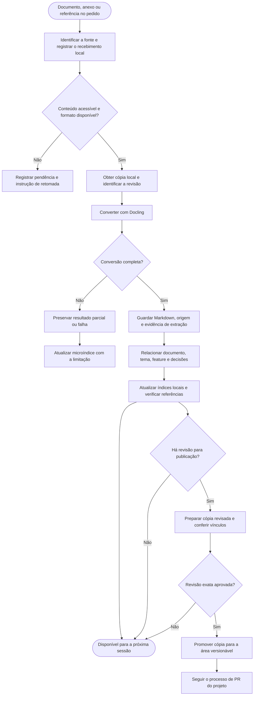

# Docling: entrada de documentos e memória interligada

Frente: ingestão de fontes para o vault. Data: 2026-10-02 (UTC).

**Estado: desenho aprovado pelo mantenedor em 2026-10-02 (UTC); implementação e provas registradas no [relatório](../../relatorios/2026-10-02-docling-ingestion.md).** O mantenedor pediu ingestão de documentos, anexos, áudio e vídeo com Docling, Markdown no vault e referências às features e demais notas. Confirmou que o material deve permanecer local e só entrar no Git após revisão. O [plano de execução](../plans/2026-10-02-docling-ingestion.md) detalha as entregas. D01–D03 têm provas reais. D04 reúne ingestão e retomada no Codex e no [Claude](../../relatorios/2026-10-03-claude-docling.md); a cobertura distingue descoberta, caminho textual no CLI e anexos não expostos.

## Resultado esperado

Ao receber uma fonte acessível, o agente registra sua origem, usa Docling para convertê-la e liga o resultado ao tema em discussão. Outra sessão deve conseguir encontrar o documento, o trecho que fundamentou uma decisão e a entrega relacionada, sem recuperar a conversa inteira. O vault continua sendo a fonte principal; índices externos podem ser reconstruídos depois.

Uma referência inacessível também recebe um registro local, com o motivo e a próxima ação. O agente não apresenta uma conversão incompleta como concluída. Um documento que descreve uma funcionalidade não comprova sua implementação ou publicação: esses estados continuam nas notas de execução e operação, com evidência própria.

## Abordagem recomendada

| Opção | O que oferece | Custo para esta entrega |
|---|---|---|
| Docling local, chamado por um comando do harness | Mesmo fluxo em Claude Code e Codex, controle de destino e privacidade, retomada sem serviço permanente | Manter a ingestão, os índices e a ligação com o cliente; Docling faz a conversão |
| Docling MCP local como entrada principal | Acesso às ferramentas do fornecedor pelo cliente | Ainda exige as mesmas regras de persistência, revisão e vínculos; acrescenta configuração de MCP |
| Docling Serve | Processamento em um serviço compartilhado | Acrescenta autenticação, armazenamento, operação e fronteiras entre projetos |

Recomendação: começar pelo comando local e pela skill compartilhada. A [documentação do MCP](https://docling-project.github.io/docling/usage/mcp/) oferece uma alternativa oficial de acesso ao conversor, mas o MCP não substitui o contrato do vault. Serve fica fora desta entrega.

## Fluxo proposto



## Captura em Claude Code e Codex

Uma skill `ingest-source`, com entradas nos dois clientes e instrução comum em `skills/`, deve ser acionada quando o pedido apresentar documentos ou referências para o trabalho. Ela recupera a fonte existente, chama o comando de ingestão e registra as relações pertinentes. O papel pode ser exercido pelo agente atual; não exige outro escritor ou agente permanente.

O hook de entrada será curto: identificar referências textuais, registrar pendências sem copiar o prompt inteiro e orientar o agente a consultar a skill. Conversão de PDF ou transcrição não deve bloquear esse hook. O trabalho pesado ocorre no comando de ingestão, com estado salvo e limite de execução.

Os contratos atuais de `UserPromptSubmit` documentam um campo textual `prompt` em [Codex](https://learn.chatgpt.com/docs/hooks#userpromptsubmit) e [Claude Code](https://code.claude.com/docs/en/hooks#userpromptsubmit). Isso não comprova a disponibilidade de todos os anexos ao hook. A cobertura será medida por cliente e versão; ler transcrições internas não será a base da captura, pois o Codex documenta esse formato como instável.

| Entrada | Comportamento exigido |
|---|---|
| Arquivo anexado com caminho acessível ao agente | Ingerir pelo mesmo comando local antes de depender do conteúdo |
| Caminho citado ou arquivo colocado na caixa de entrada do projeto | Registrar e converter o arquivo indicado; sem varrer outros diretórios |
| URL de documento ou mídia diretamente acessível | Obter o recurso indicado, registrar a origem e converter a cópia local |
| Página de vídeo, como uma página de reprodução | Identificar o fornecedor; usar aquisição oficialmente suportada e autorizada quando disponível. Sem acesso ao arquivo ou transcrição, registrar pendência |
| Anexo que o cliente mostra, mas não expõe como arquivo | Informar a limitação e indicar a caixa de entrada local. Não inventar extração |
| Formato indisponível, arquivo inválido ou mídia acima dos limites | Registrar a causa e como retomar; preservar resultados anteriores |

Captura por instrução da skill é comportamento do agente, não uma barreira técnica que garanta interceptação universal. A documentação só poderá dizer “automático” para os caminhos demonstrados em uma sessão real de cada cliente. Links dentro de documentos ficam como referências; não iniciam uma coleta recursiva.

## Armazenamento local e publicação revisada

A área local fica dentro do vault para permitir navegação no Obsidian. Ela é ignorada pelo Git por inteiro, incluindo títulos, índices, relações, imagens e transcrições. Os originais e o estado da conversão ficam na área operacional local já existente no harness.

```text
vault/
  index.md                         # índice compartilhado
  sources/
    index.md                       # fontes cuja publicação foi revisada
    <source-id>/...                 # apenas a cópia aprovada
  local/                           # ignorado pelo Git
    index.md                       # entrada do conhecimento local
    sources/
      index.md
      <source-id>/
        index.md                   # origem, relações e revisões disponíveis
        content-<revision>.md      # extração com metadados do vault
        assets/...                 # imagens locais referenciadas pela extração
.operacao-local/
  docling/
    inbox/                         # entrada manual quando necessária
    <source-id>/<revision>/...      # original, Docling JSON e recibo de execução
```

O índice compartilhado informa o caminho fixo `vault/local/index.md` como código, sem incluir nomes de documentos locais ou criar um link quebrado em clones onde a área local não existe. A skill consulta esse segundo índice quando presente. O índice local liga as fontes privadas às notas compartilhadas; o Obsidian pode mostrar os vínculos de retorno na máquina que possui essas fontes. Notas versionadas não recebem links para arquivos privados.

O validador deverá reconhecer os dois índices de entrada, verificar cada cadeia de microíndices e recusar referências da área compartilhada para a local. Ele continua funcionando em um clone sem documentos privados. Os Markdowns convertidos recebem os campos obrigatórios do vault; o texto extraído permanece distinguível das observações escritas pelo agente. O JSON do Docling e os originais não entram na varredura de notas Markdown.

Antes de gravar conteúdo, a ingestão verifica que os destinos locais estão ignorados e não rastreados pelo Git. Em repositório sem Git, prepara o ignore e informa que a verificação só poderá ocorrer após a inicialização. Se encontrar material local já rastreado, interrompe novas gravações sensíveis e orienta a correção sem apagar histórico ou retirar arquivos do índice automaticamente.

Publicar exige preparar uma cópia revisável, registrar a autorização da revisão exata e promover somente essa cópia. Se o conteúdo mudar, a aprovação anterior não vale para a nova revisão. O original privado permanece local. A cópia pública ganha identidade própria e proveniência publicável, sem expor nomes, caminhos, parâmetros de autenticação, hashes ou relações privadas. A correspondência com a fonte original permanece no registro local. Publicação deve verificar também imagens e alvos dos links; um link privado deve ser removido ou substituído por uma referência aprovada.

O comando não executa `git add`, commit ou push. A publicação segue o fluxo do projeto. Ignore não é criptografia nem backup: a documentação deve explicar que material local não acompanha clones e precisa de uma estratégia de cópia privada se houver uso entre máquinas.

## Identidade, revisões e relações

Cada fonte recebe um ID estável, independente do nome do arquivo. O recibo registra origem disponível, data, hash dos bytes, versão do Docling, opções e modelos usados, resultado da conversão e execução responsável. URLs com credenciais ou parâmetros de acesso não são reproduzidas em notas ou logs.

Bytes iguais podem reutilizar a conversão no mesmo projeto quando versão e opções também coincidirem; novos recebimentos preservam suas origens. Deduplicar processamento não funde documentos de contextos diferentes automaticamente. Uma atualização declarada da mesma fonte mantém o ID e cria nova revisão. Reprocessar com outra configuração preserva a extração anterior e identifica o novo resultado.

As notas seguem o contrato existente: `id`, `type`, `title`, `origin`, `updated` e `index`. O microíndice da fonte aponta para cada revisão e informa qual delas foi escolhida como atual. A extração aponta de volta para esse índice. Relações sempre apontam para revisões específicas quando fundamentam uma decisão.

| Relação | Evidência necessária |
|---|---|
| Documento fundamenta uma feature ou decisão | Link para a revisão e trecho, página ou intervalo de tempo disponível |
| Documento complementa ou contradiz outro | Referência aos dois trechos e justificativa; inferências identificadas como tal |
| Revisão substitui outra | Relação explícita, sem apagar o histórico |
| Execução usou documento, skill, agente ou MCP | Registro de uso observado; capacidade apenas recomendada fica separada |
| Entrega implementa uma feature | Link para código, testes e execução pertinentes |
| Publicação disponibiliza uma entrega | Evidência do ambiente e da revisão publicada, mantida no registro de operação |

Quando Docling disponibilizar página, estrutura ou tempo, a extração deve preservar a referência. Ausência dessa informação fica explícita. Um resumo não deve inventar precisão de citação. Os links de retorno são derivados das relações registradas, respeitando a fronteira entre público e local; não exigem duplicar o conteúdo do documento em cada feature.

O agente começa pelo índice do tema e consulta apenas os trechos necessários. O Markdown integral permanece disponível no vault, sem ser injetado inteiro em todos os prompts. O personalizer pode usar essas fontes para recuperar respostas já dadas, preservando dúvidas e divergências.

## Conversor, dependências e falhas

A referência consultada é Docling [v2.132.0](https://github.com/docling-project/docling/releases/tag/v2.132.0). A versão a instalar deve ser fixada após uma prova de compatibilidade no ambiente suportado. O conversor fica em ambiente Python isolado; o setup básico do harness não instala silenciosamente modelos ou dependências de mídia. O setup de ingestão informa os componentes selecionados e verifica sua disponibilidade.

A [documentação de formatos](https://docling-project.github.io/docling/usage/supported_formats/) descreve suporte a documentos e imagens. Para [áudio e vídeo](https://docling-project.github.io/docling/usage/processing_audio_media/), há pipelines próprios, dependências opcionais e necessidade de FFmpeg. Transcrição e quadros amostrados não equivalem à compreensão completa de toda informação visual de um vídeo. A matriz de suporte deverá registrar exatamente quais saídas foram verificadas.

Será reutilizada a [skill oficial de uso do Docling](https://docling-project.github.io/docling/usage/agent_skills/) para aprender a API da versão instalada. `ingest-source` acrescenta as regras do projeto sobre privacidade, persistência, recuperação e relações. Sua descoberta em Windows precisa de prova própria, sem presumir disponibilidade de links simbólicos.

Estados de extração: `pending`, `running`, `ready`, `partial`, `failed` e `unsupported`. A disponibilidade de um resultado anterior, sua revisão escolhida e o estado de uma tentativa nova são registros separados. Uma tentativa interrompida pode ser retomada sem sobrescrever o último resultado válido. Saídas são preparadas em área temporária e ativadas somente depois de verificadas.

Limites iniciais propostos: 100 MiB para documentos, 500 páginas, 500 MiB e 60 minutos para mídia, até 30 minutos por conversão e 200 quadros por vídeo. São tetos do harness, configuráveis para o projeto, não garantias de desempenho. Dependência ausente, limite excedido, OCR vazio, falha de rede e conversão parcial devem produzir resultados distinguíveis. Um vídeo parcialmente processado mantém a cobertura observada e os avisos.

O comando só lê arquivos explicitamente fornecidos e grava sob as raízes locais do projeto. Reutiliza as verificações de caminhos existentes, recusa redirecionamento por links e não executa macros ou comandos presentes no conteúdo. Aquisição remota aceita HTTP(S), com tamanho e tempo limitados e validação de destinos e redirecionamentos; endereços privados exigem configuração explícita do projeto. Conversão não deve disparar acesso remoto a recursos embutidos por conta própria. Documentos e memórias recuperadas continuam sendo dados sem autoridade para alterar as instruções da sessão.

Não haverá envio automático a serviços remotos, instalação global, coleta de outros chats ou serviço permanente nesta entrega. Modelos necessários à execução local podem exigir download no setup; esse fato e a origem devem aparecer no guia.

## Graphify e claude-mem

O contrato de [integrações e memória](2026-10-01-integration-knowledge-design.md) continua valendo. Markdown, IDs, revisões e relações serão a entrada para os adaptadores futuros. A ingestão não declara esses adaptadores instalados ou sincronizados.

Quando um adaptador estiver disponível, ele deverá respeitar o escopo local ou compartilhado de cada fonte, guardar referências à revisão e permitir reconstrução. Memória local não será enviada automaticamente a um serviço remoto. Falha de indexação externa não invalida a gravação no vault; seu estado deve aparecer separadamente. Remoção ou correção precisa invalidar as projeções correspondentes.

## Entregas e aceite

O plano de implementação deverá preservar esta ordem, com evidências por etapa:

| Etapa | Entrega | Prova exigida |
|---|---|---|
| D01 | Núcleo de ingestão local com Docling | PDF, DOCX, imagem e HTML controlados produzem Markdown navegável, origem e revisão; originais e notas locais continuam fora do Git |
| D02 | Relações, revisão e publicação | Fonte ligada a feature e decisão, repetição sem duplicar conversão, atualização preservando histórico, cópia pública revisada sem referências privadas |
| D03 | Áudio, vídeo e aquisição por URL | Áudio e vídeo curtos reais com origem e cobertura de tempo; URL direta validada; página sem acesso e conversão parcial aparecem como pendências |
| D04 | Operação nos dois clientes | Sessão real em Claude Code e Codex ingere uma entrada acessível; nova sessão recupera fonte, relações e pendências; cobertura dos hooks documentada por versão |

Cada etapa atualiza README PT/EN e guia de uso, preservando o visual. Os fluxos visíveis do processo só passam a apresentar uma etapa como disponível quando ela estiver implementada. O guia final deve cobrir instalação em projeto novo, migração preservando documentos existentes, operação diária, publicação revisada e recuperação de falhas.

Testes obrigatórios cobrem isolamento dos projetos, arquivos locais rastreados indevidamente, tentativas de escapar da raiz, destino de rede não permitido, alterações após revisão, origens com credenciais e falha durante gravação. A suíte de rotina usa fontes controladas; a validação com Docling e mídia reais é registrada separadamente, incluindo versões e duração. Stubs não contam como prova da conversão nem da captura nos clientes.

Fora deste desenho: sincronização automática com Graphify/claude-mem, serviço compartilhado, transcrição de chamadas ao vivo, downloads autenticados de qualquer plataforma e busca semântica externa. Essas capacidades podem ser acrescentadas mantendo o mesmo contrato de fontes e revisões.
