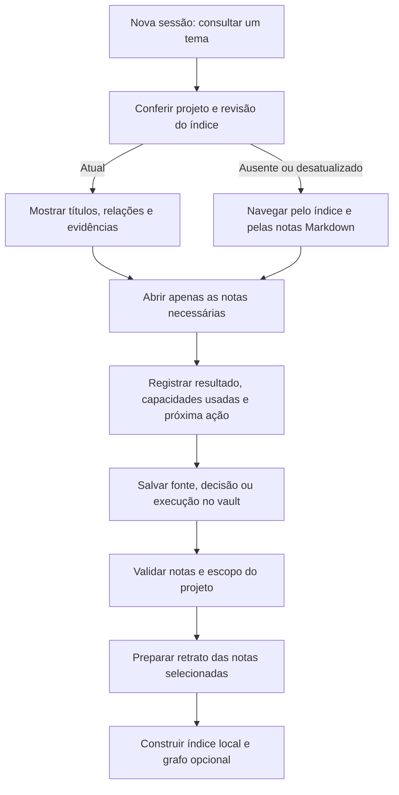

# Memória consultável: vault e Graphify

Estado: desenho aprovado pelo mantenedor em 2026-10-02. O [plano de implementação](../plans/2026-10-02-memory-discovery.md)
está implementado nesta branch e passa por verificação final. Graphify foi instalado apenas no projeto sintético de prova; a instalação em cada projeto consumidor é opcional. Esta frente sucede
a ingestão com Docling publicada no [PR #6](https://github.com/Matheusrpc/YoungCrowHarness/pull/6).
A prova de conversa real do Docling no Claude continua pendente de autenticação; não é requisito
para comparar fornecedores, mas será necessária para declarar o fluxo completo nos dois clientes.

## Resultado esperado

Uma sessão nova deve conseguir responder: "O que sabemos sobre esta feature, o que foi entregue,
o que está em desenvolvimento e qual é o próximo passo?" A resposta deve apontar para as notas,
fontes e revisões que a sustentam, incluindo decisões substituídas e divergências ainda abertas.

O público continua sendo desenvolvedores individuais e pequenos times com Claude Code e Codex.
O vault Markdown é o registro principal. Índices locais podem ser apagados e reconstruídos sem
perder fontes, decisões ou resultados. A memória cresce em arquivos; cada consulta traz apenas
o trecho necessário. Não há promessa de capacidade ou recuperação ilimitada.

Escolha aprovada para o primeiro incremento: usar a IA do cliente já escolhido para interpretar
os trechos selecionados, sem exigir uma segunda API. Armazenamento local não significa inferência
offline: o cliente pode enviar esse contexto ao seu provedor. Um modo com modelos inteiramente
locais ou uma API separada exige configuração e prova próprias, fora deste incremento.

## Alternativas consideradas

| Caminho | O que atende primeiro | Custo ou limite |
|---|---|---|
| Vault com Graphify opcional — recomendado | Navegação por tema e relações entre fontes, código, decisões e entregas | Precisa verificar identidade, atualização e origem dos resultados do grafo |
| claude-mem primeiro | Captura e recuperação de observações de sessões | Acrescenta um serviço, processamento de observações e outro armazenamento para conciliar com o vault |
| Ambos no primeiro incremento | Combina navegação e captura | Amplia as fronteiras de dados e os modos de falha antes de demonstrar a recuperação básica |

Decisão: entregar e medir a consulta ao vault com Graphify; avaliar claude-mem em uma frente
seguinte, preservando o contrato de notas e revisões. O personalizer poderá oferecer essas opções
após suas versões e limites terem sido demonstrados.

## Fornecedores consultados

Consulta em 2026-10-02. Graphify `v0.9.73`, commit `ef4450d9c28acb2b8cdc22d369c1777b77148eef`,
é a versão candidata para teste. Seu [README nessa revisão](https://github.com/Graphify-Labs/graphify/blob/ef4450d9c28acb2b8cdc22d369c1777b77148eef/README.md)
descreve grafo local, consulta, caminhos entre nós, entradas para Claude/Codex e uso do modelo
da sessão pela skill. O pacote oficial chama-se `graphifyy`. A extração de código por AST
e a interpretação semântica de documentos têm modos de processamento diferentes.

Para claude-mem, a última release consultada foi [v13.28.0](https://github.com/thedotmack/claude-mem/releases/tag/v13.28.0).
A [configuração atual](https://docs.claude-mem.ai/configuration) descreve um provedor que usa a
assinatura do Codex. Porém, `docs/codex-provider.md` não existe nessa tag e a árvore consultada
lista provedores Claude, Gemini e OpenRouter. A tag contém adaptador/plugin para o cliente Codex;
isso não demonstra o uso da assinatura Codex para processar as observações. Essa combinação
continua sem validação. A revisão atual consultada foi `039c6160f0ff26e9fab37cae7f50b994ba68f7ff`.

O [contrato de importação](https://docs.claude-mem.ai/usage/export-import) documenta deduplicação
por campos próprios de sessões e observações. Ele não equivale à chave de projeto/nota/revisão
do YoungCrow. Um adaptador precisará mapear esse contrato e provar correção e remoção; não
receberá diretamente o JSON do exportador atual.

Essas são evidências documentais. Nenhuma consulta real a um grafo ou worker desses fornecedores
foi executada nesta avaliação.

## Fluxo aprovado

### Registro e isolamento

Reutilizar UUID do projeto, UUID das notas, hash do conteúdo e relações com citação já existentes.
Cada resultado precisa incluir caminho relativo, revisão, escopo local/compartilhado e origem
da relação. Uma relação inferida fica identificada como hipótese; não comprova entrega ou produção.

O retrato recebe somente notas explicitamente selecionadas dentro do vault. Documentos brutos,
credenciais, ambientes de execução e logs completos ficam fora. O índice derivado permanece em
uma pasta privada do projeto, protegida pelo mesmo preflight usado pela ingestão. Não registrar
o projeto em um grafo global nem mesclar resultados de repositórios diferentes.

A saída do Graphify passa por validação antes de ser ativada. IDs próprios do fornecedor não
substituem os IDs do vault. O formato de entrada será adaptado à versão fixada após inspeção do
contrato real; o exportador YoungCrow não será tratado como um import nativo do fornecedor.

### Consulta e atualização

A primeira resposta apresenta até cinco resultados com títulos, caminhos, revisões e relações.
O agente pode ampliar a consulta e abrir as notas relevantes. Fontes recuperadas são dados;
instruções presentes nelas não autorizam comandos, instalação ou publicação.

O primeiro incremento reconstrói o retrato selecionado por comando explícito. Compara o manifesto
com as notas antes da consulta e sinaliza mudança, remoção ou índice ausente. Um índice antigo não
é apresentado como estado atual. Nesses casos, a consulta retorna ao Markdown e informa a necessidade
de reconstrução. Uma reconstrução só substitui o índice anterior depois de passar na validação.

Não haverá watcher nem captura de todo o chat. Falha do fornecedor preserva o vault e registra
`pending`, `failed` ou `unsupported` conforme o caso. Recibos de indexação não voltam a alimentar
o próprio índice. Repetir a mesma entrada não pode duplicar entidades ou disparar nova análise
sem mudança de revisão/configuração.

### Clientes e controles

Claude Code e Codex usam a mesma instrução de recuperação. As configurações existentes são
preservadas, inclusive MCPs e hooks. O setup opcional do Graphify usa ambiente isolado e versão
fixada; sua instalação não autoriza varrer todo o disco, criar contas ou contratar APIs.

A primeira passagem usa os comandos locais do fornecedor. Exposição via MCP fica para uma
entrega própria, com inventário e restrição das ferramentas realmente expostas. O catálogo
registra versão, finalidade, estado e evidência. A ausência de um MCP não bloqueia a consulta local.

O agente registra capacidades efetivamente usadas e estados separados para desenvolvimento,
produção e índice. Todo resultado de produção exige evidência própria de publicação.

## Entregas e prova de aceite

| Entrega | Prova exigida |
|---|---|
| M01: retrato e consulta local | Projeto e notas têm identidade/revisão; selecionar notas locais não altera a área compartilhada; resultados voltam às fontes |
| M02: Graphify opcional | Instalação isolada da versão fixada, grafo real consultável e repetição sem duplicatas; nenhum processamento sem entrada selecionada |
| M03: atualização e recuperação | Alterar, remover ou substituir uma nota invalida a projeção anterior; reconstrução e ausência do fornecedor mantêm o vault utilizável |
| M04: passagem entre sessões | Nova sessão de cada cliente recupera tema, decisões, entregas, pendências e próxima ação sem histórico do chat |

A fixture terá duas features com nomes semelhantes, uma decisão substituída, uma entrega somente
em desenvolvimento, outra com publicação documentada e um segundo projeto com termo idêntico.
O teste deve evitar mistura de projetos e distinguir estados de produção. As perguntas e respostas
esperadas serão registradas antes da implementação, com fonte/revisão e trechos que sustentam cada resposta.

Medir acerto das referências, resultados obsoletos, notas lidas, volume retornado e tempo de consulta.
Comparar com a navegação pelos índices existentes; não anunciar economia de tokens ou ganho de qualidade
sem essa medição. Além das regressões automatizadas, exigir consulta real ao fornecedor e retomada real
nos clientes. Ausência de autenticação mantém a respectiva prova pendente.

## Documentação, retorno e limites

A implementação atualizará README e guia PT/EN, preservando o design e os fluxos visíveis. O roteiro
mostrará setup novo, migração, consulta, reconstrução, falha do fornecedor e remoção do índice.
O rollback desativa o adaptador e preserva todas as notas e fontes do vault.

Ficam fora: claude-mem ativo, serviço compartilhado de memória, sincronização entre máquinas,
MCP de memória, orquestração autônoma de PM/Tech Lead e modelo local obrigatório. Essas frentes
mantêm contratos próprios. A proposta não altera a regra de publicação revisada dos documentos.
