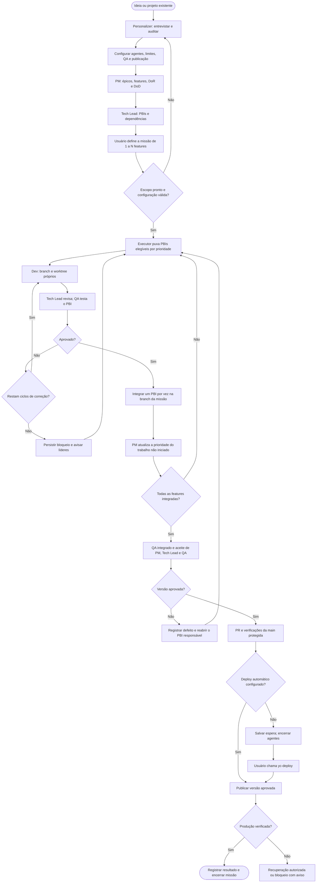

# Esteira de produto com agentes de IA

Frente: missões de produto, da descoberta à produção verificada.

Data: 2026-10-03. Estado: especificação escrita aprovada pelo mantenedor em 2026-10-03.
As capacidades e os comandos descritos neste documento são planejados. O harness atual ainda
não executa essa esteira autônoma. Este documento consolida as seis partes discutidas com o
mantenedor e estabelece o contrato para os planos de implementação.

## Resultado esperado

Um desenvolvedor ou pequeno time adota o YoungCrow em um projeto novo ou existente, personaliza
o produto e configura seus agentes uma vez. Depois seleciona de uma a N features para uma missão
com início, limites e fim definidos. PM, Tech Lead, desenvolvimento e QA são agentes de IA.
Eles refinam, implementam, revisam e integram o trabalho conforme a prioridade, com evidências no
vault. A missão entrega uma versão conjunta e termina após a verificação em produção.

O usuário pode operar com Claude Code ou Codex autenticados, escolher API explicitamente,
executar em sua máquina ou em servidor dedicado e transferir uma missão pausada entre os dois.
O uso previsto é em ambientes controlados pelo adotante. Hospedagem pública de execuções de
terceiros, revenda de acesso aos modelos e coordenação de múltiplos repositórios ficam fora desta
versão. O projeto mantém seu design system, suas instruções e suas proteções de publicação.

## Decisões confirmadas

| Tema | Contrato |
|---|---|
| Entrada | Personalizer aproveita o contexto existente e entrevista sobre o que falta |
| Configuração | Padrões por agente no projeto, com substituições explícitas por missão |
| Coordenação | Executor próprio em código; modelos executam trabalhos delimitados |
| Missão | Uma ativa por repositório; outras podem ser preparadas; uma a N features |
| Prioridade | PM pode reordenar PBIs ainda não iniciados dentro do escopo aprovado |
| Trabalho em andamento | Três PBIs por padrão, configurável |
| Execuções de agentes | Três simultâneas por padrão, configurável e separado do limite de PBIs |
| Correções | Até três ciclos de correção e revalidação por PBI |
| Qualidade | QA por PBI, revisão técnica independente e validação integrada |
| Versão | Uma versão conjunta ao final da missão |
| Deploy | Manual por padrão; automático quando configurado explicitamente |
| Fechamento | Somente após produção verificada |
| Continuidade | Pausa durável, retomada e transferência local/servidor com um único executor responsável |
| Avisos | Eventos consultáveis e terminal ativo; webhook externo opcional e configurado pelo usuário |

## Fluxo de operação

O diagrama mostra o processo proposto com atividades, decisões e responsabilidades. É uma visão
de processo em Mermaid, sem pretensão de ser um arquivo BPMN 2.0 executável. Os diagramas do
README continuam descrevendo as capacidades já entregues.

Se não houver PBI elegível, o executor persiste a razão e encerra a atividade até que um evento
ou comando permita avançar. A seta de bloqueio para a fila não representa uma consulta contínua
ao modelo. Falhas de integração, verificações do PR ou dependências externas seguem a mesma regra.

## Entrada e personalização

`yc-personalizer` usa a skill compartilhada `personalizer`. Lê os índices, perfil, decisões e
respostas confirmadas antes de perguntar. A entrevista segue a intenção do Grill Me: questionar
premissas, explicitar alternativas e aprofundar lacunas com uma pergunta por vez. Não exige
instalar outra skill para repetir um roteiro já existente.

Em um projeto novo, registra problema, público, resultado esperado, escopo inicial e restrições.
Em um projeto existente, audita código, testes, documentação, instruções, design system,
integrações, agentes, skills e MCPs; distingue evidência encontrada de hipótese. Preserva os
arquivos do adotante e documenta conflitos de regras antes de habilitar a esteira.

O perfil inclui comandos reais de desenvolvimento, testes e build, referências visuais quando
necessárias, política de branches, destino de produção, verificação e recuperação. Uma missão
pode ser preparada com campos pendentes, mas não iniciada sem os requisitos de seu percurso.
Repositórios sem interface não recebem exigência artificial de Playwright.

A personalizer chama a mesma rotina de configuração de `yc-config`. Os valores ficam globais
para as missões daquele projeto; não há alteração obrigatória das preferências de outros
repositórios. Atualizações posteriores usam `yc-config` sem repetir toda a descoberta.

Na adoção experimental, o baseline do mecanismo de retorno existente deve anteceder a primeira
escrita do harness. O setup oferece os percursos de projeto novo e migração já existentes.
Restaurar arquivos locais não desfaz deploys nem alterações em serviços externos; a personalizer
registra essa distinção quando habilita publicação. Não se cria baseline retroativo.

## Comandos separados

As skills são entradas pequenas para as operações do executor. Elas compartilham os contratos
abaixo e não mantêm filas próprias dentro do chat.

| Nome | Resultado |
|---|---|
| `yc-personalizer` | Descobre ou atualiza o perfil do produto e orienta a primeira configuração |
| `yc-config` | Define provedores, modelos, effort, capacidades e limites por agente |
| `yc-missao` | Refina o backlog e prepara uma missão com features selecionadas e critérios explícitos |
| `yc-iniciar M001` | Valida pré-condições, registra o início e despacha trabalho elegível |
| `yc-status M001` | Mostra etapa, PBIs, bloqueios, consumo, evidências, produção e próxima ação |
| `yc-pausar M001` | Interrompe novas retiradas da fila e conclui a pausa com estado recuperável |
| `yc-retomar M001` | Confere o estado persistido e retoma apenas operações elegíveis |
| `yc-transferir M001` | Conduz pausa, preparação do destino e transferência verificável da responsabilidade |
| `yc-deploy M001` | Publica a versão aprovada quando o modo manual aguarda essa ação |

No Claude Code, a entrada prevista é `/yc-iniciar M001`, por exemplo. No Codex, usa-se o seletor
de skills ou a menção `$yc-iniciar M001` na superfície que a suporta; o CLI também oferece
`/skills`. Os nomes das operações são comuns, mas a sintaxe nativa precisa ser documentada por
cliente. Não se anuncia `/yc-*` como extensão universal de todos os clientes Codex.
Fontes: [skills no Claude Code](https://code.claude.com/docs/en/skills) e
[skills no Codex](https://learn.chatgpt.com/docs/build-skills).

## Configuração e conexões de modelo

Cada papel tem provedor, modo de conexão, modelo solicitado, effort solicitado e referências
das capacidades autorizadas. A configuração usa esquema versionado, validado antes de executar.
O arquivo proposto é `youngcrow/agents.json`, sem segredos, com padrões do projeto. O consumidor
decide sua publicação; referências a credenciais contêm apenas nomes de variáveis ou perfis locais.

Ao preparar a missão, o executor grava uma cópia efetiva da configuração, suas revisões e as
substituições escolhidas. Mudar o padrão do projeto não altera uma missão existente. Uma mudança
explícita na missão cria nova revisão, conserva o histórico e reavalia as aprovações afetadas.
Modelo solicitado, modelo efetivamente informado pelo cliente, effort, cliente e versão aparecem
no recibo de cada execução. Valor não exposto pelo fornecedor fica marcado como não observado.

O executor utiliza os clientes oficiais como executores de ferramentas: `codex exec` e
`claude -p`, com saída estruturada, diretório de trabalho explícito e limites. A primeira
implementação da opção de API também usa esses clientes, com autenticação API explicitamente
selecionada. Isso conserva os dois modos de conexão sem construir um segundo ciclo de ferramentas
com chamadas HTTP próprias. Modelos disponíveis ficam limitados aos suportados pelo cliente e
pela conta escolhidos. Chamadas diretas via SDK constituiriam uma ampliação posterior, se houver
uma necessidade que os clientes não atendam.
Fontes: [Codex não interativo](https://learn.chatgpt.com/docs/non-interactive-mode) e
[Claude Code programático](https://code.claude.com/docs/en/headless).

| Opção | Autenticação e comportamento |
|---|---|
| Codex autenticado, padrão OpenAI | Cliente instalado e login próprio do usuário; respeita plano e controles do ambiente |
| Claude Code autenticado, padrão Anthropic | Binário oficial sem modificações e login nativo do próprio usuário |
| OpenAI API, opcional | Perfil explícito de API no cliente; consumo atribuído à conta API escolhida |
| Anthropic API, opcional | Credencial API explícita pelo mecanismo oficial; consumo atribuído ao seu titular |

A seleção deve conferir a precedência real de credenciais. Uma variável API já presente no
ambiente não pode mudar a cobrança sem aviso. Falha de login, cota ou modelo bloqueia a execução;
não aciona outra conexão, conta ou modelo. Credenciais nunca entram em argumentos, notas, Git,
recibos ou pacotes de transferência. O usuário autentica cada máquina pelos mecanismos oficiais.
Fontes: [autenticação Codex](https://learn.chatgpt.com/docs/auth) e
[autenticação Claude Code](https://code.claude.com/docs/en/authentication).

O YoungCrow não coleta tokens de assinatura, implementa login Claude próprio ou oferece uma
ponte de API com credenciais de assinatura. A documentação da Anthropic distingue a execução do
binário oficial autenticado pelo usuário de serviços que intermedeiam credenciais; o produto
segue essa fronteira. [Condições de autenticação e uso](https://code.claude.com/docs/en/legal-and-compliance).

O campo effort oferece termos simples como baixo, médio e alto quando o modelo suporta esses
valores. Exibe a tradução nativa antes de salvar. Opções adicionais aparecem com seus nomes e
restrições reais, por cliente/modelo; não se presume que o maior nível de um fornecedor equivale
ao maior nível de outro. Tradução é código determinístico, sem JEV ou agente roteador. O Codex
expõe `model_reasoning_effort`; o Claude Code expõe `--effort`. Uma combinação desconhecida ou
não suportada falha na validação, sem redução silenciosa do esforço.
Fontes: [configuração Codex](https://learn.chatgpt.com/docs/config-file/config-reference) e
[referência do CLI Claude](https://code.claude.com/docs/en/cli-reference).

Na descoberta, apenas versão e ajuda locais foram consultadas: Codex CLI 0.146.0 e Claude Code
2.1.220. A documentação online já contém opções além das anunciadas por esses binários. Essa
diferença exige uma matriz de compatibilidade testada. Documentação e ajuda comprovam contratos
anunciados; não comprovam autenticação, execução, enforcement ou cobrança. Nenhuma chamada de
modelo foi feita para validar esta especificação.

## Backlog, responsabilidades e critérios

Épicos agrupam features; features agrupam PBIs. A missão referencia features escolhidas, em vez
de copiar o backlog. Cada item tem UUID estável, código legível, responsável, estado, critérios,
dependências, revisão e vínculos com fontes, decisões, execuções e resultados. `M001` e `P001`
são exemplos de códigos; operações internas usam projeto e UUID para evitar colisões.

| Papel | Responsabilidade |
|---|---|
| PM | Épicos, features, prioridade, DoR/DoD e aceite de produto |
| Tech Lead | Decomposição em PBIs, dependências, decisões técnicas, revisão e integração |
| Desenvolvimento | Implementação e correções no worktree do PBI, com documentação |
| QA | Validação independente do PBI e da versão integrada, com evidências |
| Especialista em integração | Contratos e implementação conforme documentação do fornecedor quando necessário |
| Executor | Fila, estados, concorrência, limites, persistência e aplicação das condições de avanço |
| Usuário | Escopo da missão, configurações, permissões e decisões que excedem a autorização vigente |

PM e Tech Lead recebem contexto selecionado para a decisão em curso. Um retorno de agente é uma
proposta estruturada: o executor valida identidade, revisão e transição permitida antes de
registrar o efeito. Texto de um agente dizendo "aprovado" não substitui um recibo verificável.

O PM documenta Definition of Ready e Definition of Done, com contribuição técnica e de QA.
Uma missão só inicia com as features selecionadas refinadas, PBIs delimitados e dependências
conhecidas. Um PBI dependente pode aguardar outro; a retirada da fila exige dependências resolvidas.

| Nível | Condição de avanço |
|---|---|
| DoR do PBI | Objetivo pequeno, critérios testáveis, referências acessíveis, dependências resolvidas e plano de validação |
| DoD do PBI | Implementação, revisão técnica, QA aprovado, documentação e evidências vinculadas |
| Feature pronta para release | PBIs integrados e aceite do PM; ainda sem afirmar produção |
| Release aprovada | Validação do conjunto e aceite de PM, Tech Lead e QA na revisão exata |
| Missão concluída | Release implantada e produção verificada, com data, versão e evidências |

PM pode repriorizar apenas PBIs não iniciados. O executor escolhe o elegível de maior prioridade,
desempata por ordem persistida e verifica limites antes de despachar. PM não pode incluir novas
features, cancelar trabalho em andamento ou reduzir critérios por conta própria. Mudança de
escopo depende do usuário, cria revisão e reavalia planejamento, orçamento e aprovações.

## Estado, histórico e memória

A proposta usa Python e SQLite da biblioteca padrão para o estado operacional local. Um processo
coordenador escreve transições e eventos em transação. Não há serviço de fila, banco remoto ou
plataforma de workflows obrigatórios. O banco fica na área privada ignorada do projeto, em
`vault/local/operations/state.sqlite3`; worktrees de agentes não recebem acesso de escrita a ele.

O vault continua sendo o registro do conhecimento: perfil, entrevistas, critérios, decisões,
fontes e relatos de execução em Markdown. SQLite mantém a autoridade sobre operações em curso,
reservas de capacidade, tentativas, aprovações e responsabilidade do executor. Resumos Markdown
de estado são projeções identificadas com a sequência do evento. Uma edição manual no resumo
não despacha trabalho. Alterações em critérios e decisões são importadas como novas revisões
validadas, sem apagar o histórico anterior.

Uma falha ao escrever a projeção deixa o evento pendente de conciliação; retomada/status
identificam o atraso e regeneram a projeção sem repetir a operação externa. Banco indisponível
ou corrompido bloqueia despachos. Recuperação usa backup consistente e recibos para reconciliar
efeitos; não infere autorização ou tarefa concluída de um resumo antigo.

Organização prevista, reaproveitando os índices e metadados existentes:

| Local | Conteúdo |
|---|---|
| `vault/product/` | Perfil, entrevistas, critérios gerais e decisões de adoção |
| `vault/product/epics/`, `features/`, `pbis/` | Backlog e microíndices por nível |
| `vault/local/missions/<uuid>/` | Escopo efetivo, histórico, execuções, QA e release da missão |
| `vault/local/operations/` | Estado transacional, recibos operacionais e recuperação |
| `vault/local/sources/` | Documentos convertidos pelo Docling e relações com evidência |
| `vault/integrations/`, `vault/capabilities/` | Contratos e catálogos existentes; detalhes privados nos microíndices locais |

Os diretórios de backlog seguem a política de visibilidade da adoção. Notas e fontes sensíveis
ficam locais; só cópias revisadas entram na documentação compartilhada. Os índices públicos não
dependem de caminhos privados para serem compreendidos. O setup precisa garantir as exclusões
antes da primeira escrita privada.

Cada evento registra UUID, sequência, horário UTC, ator, missão/item, operação, execução,
transição, revisão do código e referências de evidência. A interface pode exibir o fuso do projeto.
Criação, refinamento, desenvolvimento, QA, deploy e verificação em produção conservam todas as
ocorrências, inclusive reprovações e retrabalho. Não se sobrescreve a primeira entrega com a
data da tentativa mais recente. A sequência transacional ordena eventos mesmo com relógios de
máquinas divergentes; duração e consumo são registrados separadamente.

O recibo da execução registra cliente, modelo, effort, agente, skills e MCPs solicitados e os
efetivamente observados. Disponibilidade em catálogo, configuração, tentativa e uso comprovado
são campos distintos. Capturas, saídas e documentos ficam privados por padrão.

Uma nova sessão começa pelo índice geral, passa pelo microíndice da missão e segue os vínculos
para o item e suas evidências. O pacote de contexto traz apenas objetivo, critérios, decisões,
fontes e trabalho anterior pertinentes, com UUIDs e revisões. Uma nota não amplia automaticamente
a seleção do Graphify. Graphify continua opcional; claude-mem permanece uma integração futura.
Retenção e navegação no vault permitem continuidade além do chat, sem prometer contexto de
modelo ilimitado ou armazenamento infinito.

## Fila, paralelismo e branches

Uma missão preparada passa por `ready`, `running`, validação integrada, espera ou publicação,
verificação e `completed`. `paused`, `blocked` e `transferring` preservam a etapa de origem.
Estados terminais e cada retorno têm condições explícitas; só `completed` afirma produção
verificada. Uma missão iniciada, mesmo pausada ou aguardando deploy, ocupa a vaga única do
repositório até encerramento ou cancelamento explícito do usuário. Cancelamento conserva
histórico e não é apresentado como entrega.

Um PBI percorre refinamento, pronto, desenvolvimento, revisão/QA, espera de integração e
integrado. Reprovação o leva à correção ou ao bloqueio. Desenvolvimento, revisão, QA, correção
e espera de integração contam no limite de três PBIs. Bloqueado sai do conjunto ativo e libera
uma vaga; seus dependentes aguardam. Retomá-lo precisa adquirir vaga novamente.

Há também três execuções de agentes simultâneas, compartilhadas por todos os papéis. O
coordenador reserva essa capacidade antes de invocar o cliente e a libera quando a execução
termina ou sua interrupção foi confirmada. Delegação aninhada não gerenciada é desabilitada;
trabalho delegado precisa passar pelo mesmo orçamento e reserva. Configurações que não permitam
conter a concorrência real ficam sem suporte para execução autônoma até comprovação.

Cada PBI usa branch e worktree exclusivos, criados a partir da base de integração registrada.
Há um único escritor por checkout, inclusive para documentos compartilhados: agentes entregam
propostas locais e o coordenador concilia os registros centrais. O checkout original com trabalho
do usuário é preservado. Worktree organiza Git; isolamento de permissões exige controles do
cliente e do sistema operacional.

PBIs aprovados integram um por vez na branch da missão. Antes de integrar, comparar base atual,
dependências e alterações concorrentes. Conflito textual ou incompatibilidade semântica bloqueia
essa integração, exige resolução delimitada e revalidação. Um lock de integração evita dois
merges simultâneos; não evita defeitos entre mudanças que o Git consegue combinar sozinho.

O candidato integrado conserva referências aos PBIs e às aprovações. Mudança de base ou conteúdo
invalida as provas afetadas. A release passa por PR para `main` e respeita verificações, revisões
e permissões do repositório. Nenhum worker recebe autorização genérica de push para main,
force-push, bypass de proteção ou deploy.

## QA e autocorreção

O plano de validação é definido por stack e risco. Inclui os testes, build, análise estática,
tipagem e verificações de segurança pertinentes, com comandos e resultados esperados. O runner
registra a saída real e o código de retorno; o modelo interpreta a evidência. Um processo com
saída zero não substitui os demais critérios de aceite.

Tech Lead revisa código e QA valida em execução separada do implementador. Podem usar o mesmo
modelo, mas não a sessão que produziu o código como único aprovador. O revisor recebe critérios,
diff e fontes necessárias, sem confiar no relato do implementador como prova. Alterações nos
testes, regras de aceite ou configuração de validação também entram na revisão.

Para interfaces, Playwright abre o produto em localhost e exercita navegação, formulários,
sucesso/erro, teclado e tamanhos relevantes de desktop e celular. O QA compara capturas com o
design system ou referência aprovada e registra o parecer visual. Captura sozinha não comprova
funcionamento. Baselines produzidos pelo próprio código não são aprovados automaticamente;
ausência de referência necessária devolve o item ao refinamento.

Servidores e navegadores do ensaio têm dono e identificadores de processo. Encerramento ocorre
em `finally`, também em falhas; verifica-se que não restou processo pertencente ao ensaio.
Nunca se encerra navegador ou processo alheio. O runner separa a fase de captura da chamada paga
de análise, respeitando a restrição atual do harness sobre navegador durante execução paga.

Cada PBI permite implementação inicial seguida de até três ciclos de correção. Um ciclo começa
quando uma correção é despachada e inclui sua revalidação. A terceira reprovação bloqueia o item
e avisa os líderes. Falha de ambiente, credencial ou ferramenta é bloqueio operacional; não é
tratada automaticamente como defeito de código. Uma interrupção não apaga o ciclo já iniciado.

Falha integrada é atribuída a PBIs existentes quando possível, conservando seu contador. Se
exigir trabalho não previsto, Tech Lead propõe novo PBI e o usuário valida a mudança de escopo
quando aplicável. Não se cria um novo identificador para renovar tentativas do mesmo defeito.
Uma pausa, transferência ou troca de cliente nunca zera tentativas.

As aprovações ligam papel e execução ao commit, árvore Git, base de integração, critérios,
configuração relevante e hashes das evidências. Revalidação é necessária quando esses insumos
mudam. A versão conjunta exige aceite de PM, Tech Lead e QA; aprovação dos agentes não substitui
autorização humana exigida pelo projeto ou pelo provedor.

## Release, publicação e recuperação

O candidato aprovado é identificado por commit, árvore Git e artefato com digest quando houver
build. Depois do merge, o executor confere a correspondência na main. Se o merge produzir um
commit novo, verifica sua árvore e executa os checks exigidos sobre a revisão final. Mudança de
conteúdo ou base retorna à validação e às aprovações afetadas. Publicação usa o artefato aprovado
ou um build verificável da revisão final; nunca apenas "o último build disponível".

No modo manual, a missão entra em espera persistida após os gates. Os agentes encerram e
`yc-deploy M001` confere novamente revisão, evidências e autorização antes de publicar. No modo
automático, essa operação ocorre após os mesmos gates, dentro do alvo e permissões configurados.
O contrato de adoção precisa controlar workflows de publicação já existentes: se um merge em
main dispara deploy automaticamente, o modo manual exige ajustar esse gatilho ou aguardar antes
do merge. O preflight bloqueia uma configuração que prometa controle manual sem poder cumpri-lo.

A personalizer registra o comando ou workflow do fornecedor, ambiente, mecanismo de consulta,
janela finita de verificação e procedimento de recuperação. O especialista em integração usa
`integrate-from-docs` e fontes oficiais ingeridas pelo Docling para implementar esse contrato.
Nenhum destino ou comando de produção é inferido de exemplos do template.

Deploy aceito pelo fornecedor leva à verificação: conferir a revisão publicada, saúde e fluxos
críticos definidos, com dados de teste e acessos autorizados. Só o sucesso dessas verificações
marca a missão como concluída. Falha preserva o último estado conhecido de produção e impede
novas publicações até resolução.

Recuperação automática exige procedimento previamente autorizado, configurado e validado para a
mudança. Ela registra versão anterior, tentativa e verificação do retorno. Sem retorno seguro,
ou se ele falhar, o executor bloqueia e avisa o operador. Migrações de dados têm plano próprio;
republicar um artefato antigo não implica restaurar dados. A recuperação bem-sucedida não transforma
uma release rejeitada em missão concluída.

## Limites, interrupção e transferência

Antes do início devem estar preenchidos limites finitos de tempo ativo da missão, duração de
cada execução de agente, quantidade de execuções despachadas e tentativas de operações externas.
O projeto escolhe os valores; a missão herda ou registra substituições explícitas. O limite de
deploy é separado dos três ciclos de correção de PBI. Tempo de pausa persistida e espera manual
não consome tempo ativo. Os contadores sobrevivem à retomada e à mudança de máquina.

Para API, registrar orçamento estimado, uso e custo quando expostos pelo fornecedor. Reservas
consideram execuções concorrentes antes de despachar. Estimativas não garantem teto exato de
fatura; métricas indisponíveis são declaradas. Se o cliente oferece um limite aplicável, o
adaptador o usa além dos limites do harness. Assinaturas usam indicadores reais disponíveis,
sem custo monetário fictício. Retries internos do cliente, quando não observáveis, não são
apresentados como chamadas individualmente contabilizadas.

Ao atingir limite, interromper novos despachos e conduzir as execuções ao encerramento dentro
do prazo configurado. Terminar apenas os processos pertencentes à missão. Se houver efeito
externo de resultado desconhecido, persistir a incerteza e reconciliar antes de repetir.
Retomada exige resolver a causa ou ampliar o limite explicitamente, sem apagar consumo anterior.

Iniciar, retomar, transferir e publicar usam identidade durável de operação e precondições de
estado. A transação registra a intenção antes de chamar o fornecedor. Repetição do comando
consulta o recibo existente. Falha entre envio e recebimento não dispara outra chamada por
presunção: usa chave idempotente ou consulta suportada pelo fornecedor; sem isso, exige resolução
do resultado incerto. Não há promessa de exactly-once para serviços que não oferecem esse contrato.

O mesmo executor roda localmente e em servidor dedicado, em primeiro plano ou sob um supervisor
do sistema. Fechar o chat não mata uma execução de servidor. Suspensão ou falha da máquina local
exige recuperação dos processos e recibos; não há failover automático para outro host.

A transferência é explícita e offline em relação à execução dos agentes:

1. Pausar a origem, impedir novos despachos, encerrar seus processos e reconciliar operações externas.
2. Verificar o destino, sua identidade, clientes, autenticação, permissões, runtimes e espaço.
3. Registrar uma entrega de responsabilidade vinculada ao destino e tornar a origem inelegível
   para retomar aquela geração. Gerar pacote privado com backup consistente do estado, Git e
   trabalho ainda não integrado, configuração, notas e evidências necessárias, com manifesto e hashes.
4. Importar no destino em estado pausado, verificar integridade, reconstituir worktrees e revalidar
   ambiente. Credenciais, caches de login e dados não selecionados não fazem parte do pacote.
5. Confirmar a nova geração responsável; só o destino então pode retomar. Conservar o recibo na
   origem e o material de recuperação até a transferência estar verificada.

Uma tentativa repetida não importa nem inicia duas vezes a mesma entrega. Confirmação perdida,
origem inacessível ou processo ainda vivo bloqueia a troca até conciliação. Timeout de lock não
prova que o executor antigo parou. Não se oferece tomada automática da missão por outro host.
Git remoto sozinho não transfere dados ignorados do vault. O pacote usa transporte escolhido
pelo operador; o harness não cria um serviço de sincronização nem envia dados privados a terceiros.

O controle de responsabilidade cobre as operações suportadas do YoungCrow em hosts cooperantes.
Copiar manualmente estado antigo, alterar o banco ou executar comandos fora do harness pode
violar esse contrato; um lock local não é garantia distribuída contra administradores dos hosts.

## Permissões e avisos

Antes de executar, auditar as capacidades efetivas, inclusive camadas globais, de projeto e
gerenciadas. Registrar origem e revisão de skills, agentes, hooks e MCPs. Catálogo não autoriza
ativação. Permissões de leitura, escrita, rede e ferramentas devem corresponder ao papel e ao
worktree; políticas mais restritas do usuário continuam válidas. Se o cliente não permite impor
a fronteira necessária, a combinação fica bloqueada para execução autônoma.

Workers não podem modificar o banco operacional, aprovar sua própria execução ou obter segredos
de produção. O publicador é uma operação separada do coordenador com credenciais restritas ao
alvo. Comandos passam argumentos estruturados ao processo; documentos e retornos de modelo não
viram código de shell. Instruções contidas em fontes, páginas ou saídas MCP são dados não confiáveis.

Eventos relevantes acordam os agentes líderes quando há uma decisão de produto ou técnica a
tomar. O executor realiza decisões mecânicas sem LLM. Deduplicação por evento, revisão e papel
evita avisar os líderes em loop. Uma entrega pode liberar prioridade para o próximo PBI da missão,
mas não inicia outra missão por conta própria.

O usuário acompanha por `yc-status` e pelo terminal ativo, quando disponível. Webhook externo
é opcional, configurado com destino e autenticação explícitos. Envia identificação, motivo e
referência ao estado, sem documentos ou segredos. Tentativas de entrega são limitadas e eventos
têm ID para deduplicação pelo receptor. Falha de notificação fica registrada e visível no status.
Sem canal externo, o evento permanece consultável; não se promete aviso com o chat fechado.

## Frentes de implementação e provas de aceite

O desenho é dividido em quatro entregas para evitar um único plano grande demais. A ordem
preserva os contratos entre elas. Cada frente terá plano próprio e prova proporcional antes
de integração; detalhe novo de arquitetura passa por especificação focada, sem reabrir decisões
já confirmadas. O primeiro plano deve cobrir a frente 1. As demais completam o resultado desta
especificação; a existência de comandos ou simulações não basta para anunciar a esteira pronta.

| Frente | Entrega | Prova necessária |
|---|---|---|
| 1. Perfil e contrato da missão | Personalizer, configuração, backlog, DoR/DoD, histórico e entradas de preparação/status | Setup novo e migração preservam dados; configuração herdada e substituições; revisões, índices e transições inválidas; sem despachos pagos |
| 2. Execução e continuidade | Adaptadores, fila, limites, branches/worktrees, pausa e transferência | Limites distintos de três PBIs/agentes; repriorização válida; retomada sem duplicação; falhas de processo; transferência nos dois sentidos; clientes autenticados e APIs opcionais com provas delimitadas |
| 3. QA e integração | Revisão, QA por PBI, Playwright, correções e validação conjunta | Defeito real reprovado; terceira correção bloqueia; ambiente inválido não passa; conflitos e aprovações antigas rejeitados; evidência visual/funcional; zero processos próprios remanescentes |
| 4. Release e operação | PR, deploy manual/automático, verificação, recuperação e avisos | Main protegida; revisão/artefato exatos; gatilhos existentes respeitam modo manual; falha de deploy reconciliada; produção verificada; retorno autorizado; webhook sem conteúdo privado |

As provas completas incluem missão com uma feature e com várias, em consumidores novos e
existentes. Devem mostrar a diferença entre PBI integrado, feature pronta e produção verificada,
e permitir a uma sessão nova localizar os resultados sem receber o histórico inteiro no prompt.
Perda de processo após efeito externo, comando repetido, limite esgotado e transferência
interrompida são cenários obrigatórios de recuperação.

Testes determinísticos usam adaptadores controlados e não acionam modelos. Provas nativas são
separadas: declaram cliente, versão, caminho de autenticação, escopo, tempo, quantidade e orçamento
antes da primeira chamada, com marcador durável. CLI disponível ou teste simulado não comprova
suporte nativo. Cada combinação anunciada precisa de prova real; ausência de credencial conserva
a pendência. Provas de funcionalidades anteriores não validam automaticamente a futura esteira.

Cada implementação atualiza README, guia PT/EN afetado, exemplos, diagramas e memória pertinente,
com revisão `humanizer` e preservação do design atual. O guia final deve explicar setup do zero,
migração, configuração, preparação/início, status, pausa, retomada, transferência, QA, deploy e
saída do trial. Documentação de uso só anuncia os comandos depois de instalados e verificados
nos clientes correspondentes.

## Revisão e próximo passo

As escolhas conceituais foram aprovadas durante a entrevista. A revisão escrita aprovou também
SQLite, a organização de arquivos, o uso de API por meio dos clientes oficiais e o protocolo de
transferência. Nenhum executor, skill de comando, agente de produto ou configuração de publicação
foi implementado nesta etapa.

O [plano da frente 1](../plans/2026-10-03-mission-foundation.md) detalha arquivos afetados,
cenários de aceite e verificações. Sua revisão e a escolha do método de execução precedem
alterações de produto.
