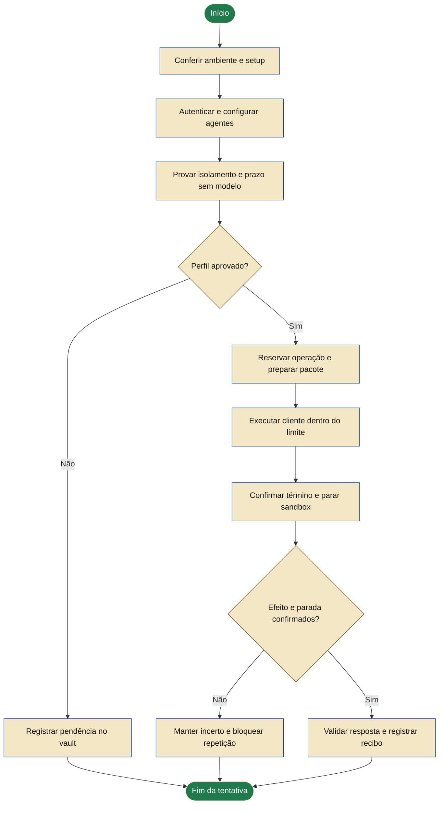

# Executor isolado para Claude Code e Codex

Frente: 2A / YC-203. Desenho aprovado em 2026-10-04 UTC; implementação local parcial, sem perfil certificado.

Decisão de produto posterior: [execução local por padrão e runner dedicado opcional](2026-10-05-local-and-dedicated-execution.md).
Os dois destinos compartilham a esteira e seus requisitos. O ciclo de ensaios abaixo
está encerrado; o próximo desenho detalhará setup, pré-requisitos e conexão do runner.
R1 permanece parcial e nenhum perfil foi habilitado.

Revisão em 2026-10-05: [saída por domínio](2026-10-05-hostname-egress-decision.md)
aprovada e [ensaio executado](../../relatorios/2026-10-05-hostname-cidr-proof.md).
O domínio permaneceu acessível sob negação universal de IP; a combinação não atende
ao requisito do YoungCrow. A [instalação local exclusiva](2026-10-05-exclusive-egress-decision.md)
foi aprovada para controlar a saída após a injeção. O [plano da prova](../plans/2026-10-05-exclusive-egress-proof.md)
aguarda revisão; configuração inalterada.
Requisitos aprovados e perfis vazios preservados. Este estado substitui as ações
históricas dos checkpoints abaixo.

Resultado nativo em 2026-10-05: a [compatibilidade do candidato](../../relatorios/2026-10-05-native-proxy-compatibility.md)
não foi estabelecida. O Docker substituiu a credencial descartável por domínio e recusou
o nome do serviço nos túneis por IP sem interceptação. Os requisitos permanecem vigentes;
a próxima revisão deve partir do caminho por domínio e comprovar o controle do destino
final. Nenhum intermediário foi integrado, guard desligado ou perfil habilitado.

Prova conjunta autorizada e concluída em 2026-10-05: o [candidato de origem fixa](../../relatorios/2026-10-05-auth-egress-spike.md)
passou nos casos sintéticos do terceiro ciclo. Os dois desenhos anteriores falharam nas
fixtures. A compatibilidade com o proxy real, OAuth e isolamento entre processos continua
sem prova. Próximo: validar o contrato nativo antes de integrar. Este resultado não aprova
a implementação de um novo intermediário nem certifica os perfis.

Checkpoint de viabilidade em 2026-10-05: a [investigação de DNS/proxy](../../relatorios/2026-10-05-proxy-resolution.md)
não comprovou o destino final da conexão. O comportamento TLS também ocorreu fora do Docker;
a causa não foi atribuída. A candidata de saída direta não oferece a injeção documentada de
credenciais do forward proxy. Autenticação e isolamento MCP precisam de uma solução conjunta;
a nova prova proposta aguarda decisão. Os requisitos abaixo permanecem vigentes, sem
autorizar cópia de tokens, backend alternativo ou implementação de um novo proxy.

Atualização de implementação: a [revisão do contrato de lançamento](../../relatorios/2026-10-04-isolated-executor.md#impedimento-no-supervisor)
encontrou uma incompatibilidade com o supervisor por entrypoint/PID 1 previsto no plano.
O [ensaio autorizado do supervisor interno](../../relatorios/2026-10-04-supervisor-spike.md)
já comprovou parte das fronteiras em uma fixture descartável. O candidato usa um lançador
confiável na microVM e PID 1 em um contêiner separado. Protocolo, perda do coordenador e
[reinício ativo](../../relatorios/2026-10-04-shutdown-reserve.md) têm provas sintéticas.
Rede/MCP, suspensão e autenticação continuam pendentes; R1 está incompleto e R2/R3 não começaram.

O mantenedor aprovou o caminho de ambiente separado depois das
[provas dos perfis locais](../../relatorios/2026-10-04-native-permission-controls.md).
Este documento detalha esse caminho e foi aprovado pelo mantenedor: “aprovado bora”.
O [plano de implementação](../plans/2026-10-04-isolated-executor.md) também foi aprovado; R1 está em andamento.
A aprovação do desenho não comprova o funcionamento das dependências escolhidas aqui.

As fontes oficiais estão ligadas nas seções abaixo. Extrações e registros desta pesquisa ficam
no vault local do mantenedor, separados do template instalado nos projetos consumidores.

## Resultado esperado

O desenvolvedor prepara o ambiente uma vez, autentica seus clientes e escolhe modelo e esforço.
O harness executa um trabalho delimitado sem expor a pasta pessoal, o banco operacional ou as
credenciais do coordenador. Uma queda não pode deixar uma chamada rodando sem prazo. O recibo
permite retomar a operação em outra sessão, sem cobrar ou executar novamente por acidente.

O primeiro aceite é um diagnóstico real de Claude e outro de Codex, por assinatura, com até
120 segundos por cliente e uma tentativa por manifesto. A fila de produto, três PBIs por padrão,
priorização por agentes, QA, integração e deploy continuam nas etapas já aprovadas.
Uma prova de diagnóstico não certifica o futuro perfil de desenvolvimento.

## Backend proposto

Usar **Docker Sandboxes local (`sbx`)** para a primeira implementação. O fornecedor oferece
microVMs para os clientes existentes e não exige Docker Desktop ou Docker Engine no host.
As plataformas declaradas incluem Windows 11 x64 e Ubuntu 24.04 com KVM. A matriz YoungCrow
só incluirá uma combinação depois de sua própria prova.
[Instalação](https://docs.docker.com/ai/sandboxes/install/).

O runtime local é gratuito segundo a documentação consultada em 4 de outubro de 2026; exige
uma conta Docker. Nuvem Docker e governança empresarial paga ficam fora desta entrega.
Uso e limites dos fornecedores de modelos continuam ligados à conta escolhida.
[Condições do runtime](https://docs.docker.com/ai/sandboxes/faq/).

Comparação que sustenta a escolha:

| Alternativa | Decisão para este incremento |
|---|---|
| Docker Sandboxes local | Primeira opção de prova, por oferecer microVM e integração documentada com os dois clientes |
| Contêiner OCI comum | Não é fallback automático; exigiria sua própria prova de fronteira com o host |
| VM montada e mantida pelo YoungCrow | Evitar construir distribuição, hipervisor ou gerenciador de credenciais próprio |

No host inspecionado, Windows 11 x64 tem hipervisor ativo, mas `sbx` não está instalado e o
recurso Windows Hypervisor Platform está desabilitado (`InstallState: 2`). WSL também está ausente; não é requisito
automático deste desenho. Ativar o recurso do Windows exige administração e pode exigir reinício.
Essa mudança deve ser feita em uma janela escolhida pelo operador; o harness não reinicia a máquina.
O estado foi interpretado pela [referência do Windows](https://learn.microsoft.com/en-us/windows/win32/cimwin32prov/win32-optionalfeature).

## Fronteiras

| Componente | Pode fazer | Não recebe |
|---|---|---|
| Coordenador YoungCrow no host | Reservar operações, manter SQLite/vault, validar recibos e coordenar publicação | Texto do agente como autorização para executar comandos no host |
| Gerenciador `sbx` no host | Gerenciar microVM, políticas e autenticação pelo mecanismo do fornecedor | Comandos de ciclo de vida vindos do projeto ou da resposta do modelo |
| Executor na microVM | Executar cliente oficial e produzir resultados dentro do pacote autorizado | Pasta pessoal, checkout original, banco do coordenador, credenciais de Git/deploy ou sockets do host |
| Cliente oficial | Usar a conexão escolhida e manter estado próprio dentro do executor | Direito de alterar configuração global do desenvolvedor |

Os binários, imagens e o gerenciador são dependências confiáveis que precisam de identidade
registrada. O modelo, os documentos, as configurações do projeto e a saída do agente são dados
não confiáveis. Administrador hostil do host e falha do hipervisor não são riscos eliminados
pelo harness. O desenho protege contra acesso do trabalho executado fora do seu escopo.

Mudanças em versão, imagem, configuração efetiva, política ou mecanismo de autenticação
invalidam a prova anterior. Não existe uma entrada permanente de suporte por nome de cliente.
Atualização automática do runtime não habilita a nova versão: o preflight exige nova verificação.

## Entrada e saída de arquivos

O diagnóstico começa sem montar o projeto. Só recebe o manifesto sanitizado, o nonce e os
arquivos fictícios de prova. O runtime usa seu próprio estado gravável; a proibição anterior
de qualquer gravação interna do cliente é substituída por uma fronteira explícita: nenhuma
gravação no estado do coordenador, com escrita permitida apenas no espaço privado do executor.

Para a futura fila, a entrada será um pacote de uma revisão exata com arquivos e notas
explicitamente selecionados. Nunca se passa o checkout original a `sbx run` ou `--clone`.
O clone do fornecedor ainda torna arquivos ignorados e não rastreados legíveis na VM.
[Fronteiras de arquivos](https://docs.docker.com/ai/sandboxes/security/isolation/).

O pacote exclui `.git`, `.env`, credenciais, banco, recibos privados, backups do trial e caches.
Não segue links simbólicos, reparse points ou hard links para outros arquivos. Um arquivo sensível
explicitamente selecionado exige revisão antes de entrar; estar versionado não o torna seguro.
Hashes e limites de tamanho são conferidos antes e depois da cópia.

Resultados voltam como dados para uma área privada de quarentena: manifesto, conteúdo e hashes.
O host não executa scripts recebidos, não carrega hooks/configurações do pacote e não importa
objetos Git ou aprovações declaradas pelo agente. Neste incremento, a saída útil é só o recibo
do diagnóstico. Integração de código continua em 2B/3, por revisão exata e um escritor por checkout.

## Autenticação, modelos e esforço

Claude Code e Codex oficiais continuam os executores. Assinatura é o padrão, API é opção explícita
e permanece indisponível até haver prova de autenticação, precedência e orçamento aplicáveis.
O YoungCrow não constrói um cliente de modelos, login próprio ou serviço de roteamento.

O `sbx` possui fluxo OAuth para Codex e login Claude pelo cliente. Na configuração proposta,
o gerenciador do fornecedor conserva os tokens fora da VM e fornece valores substitutos ao
executor. Isso acrescenta o `sbx` à fronteira de confiança da autenticação; não é cópia automática
dos caches já existentes no computador. O usuário faz o novo login e pode revogá-lo.
[Codex](https://docs.docker.com/ai/sandboxes/agents/codex/) e
[Claude Code](https://docs.docker.com/ai/sandboxes/agents/claude-code/).

O preflight deve observar o mecanismo realmente selecionado, sem ler ou registrar o segredo.
Se uma credencial API global tiver precedência sobre OAuth, a execução por assinatura é recusada.
Um arquivo dizendo “autenticado”, uma variável substituta ou o sucesso da requisição não bastam.
O binding do kit deve autorizar somente OAuth e os destinos necessários. Kit que permita
passthrough de token real, comandos de obtenção de segredos ou mecanismos ambíguos é recusado.
[Credenciais e precedência](https://docs.docker.com/ai/sandboxes/configuration/credentials/).

Padrões de agente e substituições por missão continuam em `youngcrow/agents.json`. O executor
consulta o catálogo efetivo do cliente na combinação aprovada. `latest` resolve a recomendação
atual da conta; `client-default` conserva o esforço nativo. Valores explícitos são preservados.
Nenhum modelo é fixado no código do produto ou trocado para fazer um teste passar.

Solicitado, resolvido e observado são registrados separadamente. Se a integração do gerenciador
não permitir conferir assinatura ou catálogo, a pendência é mostrada antes da chamada real.
Não há fallback para API, outro fornecedor, execução no host ou outro modelo.

## Rede, skills, agentes e MCPs

Preparação e execução têm permissões distintas. Downloads de imagens e login pertencem ao setup;
não justificam acesso amplo de rede durante uma chamada. O diagnóstico permite só os destinos
necessários ao cliente escolhido. Bloqueia outros provedores, host, rede privada e serviços de
metadata. Portas de entrada ficam fechadas. Toda regra é conferida na política efetiva da sandbox.

O preset `Locked Down` não basta: kits e regras globais podem acrescentar acessos. O setup
preserva políticas globais existentes. Uma política global ou administrativa incompatível gera
pendência; o harness não a redefine nem compra governança empresarial para contorná-la.
Pedidos de acesso não previsto falham e voltam como pendência, sem concessão pelo próprio agente.
[Política local](https://docs.docker.com/ai/sandboxes/governance/access-controls/local/).

O diagnóstico usa pacote sem skills externas, MCPs ou subagentes. Desabilita compartilhamento
de skills, encaminhamento SSH, clipboard e remote control. Pela [decisão aprovada sobre MCP](2026-10-04-mcp-boundary-decision.md),
o gateway pode existir na camada confiável do gerenciador, desde que o cliente e seus descendentes
não consigam acessá-lo. Essa condição exige prova de rede, arquivos, ambiente e descritores,
inclusive com o provedor de IA acessível. Servidores MCP podem executar fora da microVM;
nenhum acesso é concedido implicitamente. Um controle não observável deixa o perfil sem suporte.

Na fila futura, o catálogo YoungCrow selecionará agentes, skills e MCPs por identidade e escopo;
o pacote conterá apenas os aprovados. Essa preparação mantém os índices do vault como referência
de contexto, sem expor todo o vault. O sandbox não substitui a governança do harness.

## Prazo e queda do coordenador

O supervisor atual contém o processo chamado no host. Isso não prova encerramento do trabalho
mantido pelo daemon de uma microVM. Sandboxes locais do fornecedor não têm o TTL do produto
cloud. Não se usa `--ttl` local como se fosse proteção válida.
[Escopo do TTL](https://docs.docker.com/reference/cli/sbx/ttl/).

A primeira tarefa de implementação deve provar um prazo independente do coordenador, sem modelo
real. A proposta técnica é executar o cliente sem privilégios em um contêiner interno, com um
supervisor como PID 1, protegido do usuário do cliente. A microVM fornece a fronteira do host;
o contêiner limita duração e recursos. O cliente roda sem sudo, sem capabilities adicionais,
sem socket Docker e com `no_new_privs` ligado. O agente não pode matar, reconfigurar ou
estender o prazo do supervisor. O limite vem do manifesto, não do texto gerado.

Esse mecanismo é uma hipótese de implementação a ser validada, não uma capacidade atribuída ao
`sbx`. A prova precisa matar o coordenador deliberadamente, forçar descendentes e tentativas de
escape, e demonstrar zero processos de modelo após o prazo. Também cobre perda do transporte,
reinício do daemon e reutilização da sandbox. Se falhar, não há chamada autenticada nem entrega
marcada funcional; o desenho deve ser revisto antes de integrar o adaptador.

O controle de duração já instalado no host continua como segunda barreira. Depois do término,
o harness para somente a sandbox identificada na reserva e confirma seu estado. Não usa prefixo
de nome como prova de propriedade, reset global ou encerramento genérico. Uma VM parada pode
permanecer para diagnóstico, sem processos nem acesso de rede, até remoção explícita ou pela
política de retenção aprovada. Apagar a sandbox não apaga recibos nem recupera consumo.

## Estado durável e integração com o código existente

### Protocolo do guardian (refinamento de R1, 2026-10-04)

O spike do contêiner interno permite implementar o protocolo em Python, com a biblioteca padrão.
Um lançador confiável na microVM prepara um diretório de controle exclusivo por operação, fora do
HOME do cliente. O guardian roda como PID 1 de um contêiner separado; não substitui o entrypoint
reservado pelo `sbx`. O diretório persiste durante reinícios e pertence a root, com modo 0700.

O manifesto protegido fixa UUID, nonce, prazo absoluto, comando de descoberta e prefixo do cliente
permitido para diagnóstico. Antes de qualquer subprocesso, o guardian cria um marcador exclusivo
de consumo e sincroniza arquivo e diretório. A existência do marcador, mesmo incompleto, bloqueia
outra execução. Uma falha de persistência impede o despacho; não se promete conclusão exatamente
uma vez, pois uma queda pode consumir a operação sem concluir o trabalho.

O canal privado recebe JSON por linha, limitado a 16 KiB. Aceita `initialize` uma vez e `dispatch`
uma vez, após descoberta bem-sucedida. Cada fase grava seu marcador antes de produzir efeitos.
Identidade divergente, campos desconhecidos, mensagem repetida, ordem inválida ou JSON ambíguo
encerram a operação. O prazo inclui descoberta, espera e diagnóstico; nenhuma mensagem o amplia.
O cliente recebe stdin fechado, ambiente permitido explicitamente e nenhum descritor do controle.

Os testes locais verificam o protocolo e concorrência. Permissões Linux, persistência no volume,
separação de descritores e encerramento por PID 1 exigem prova real. Esse incremento mantém o
catálogo de perfis vazio e os clientes nativos desabilitados até o restante do aceite de R1.

Reusar `mission_runs.py`, SQLite, UUIDs e projeções do vault. O adaptador de sandbox deverá
entregar observação, plano de execução, resultado e prova de parada aos mesmos contratos.
A reserva existe antes de criar/iniciar recurso externo ou fazer chamada ao fornecedor.
Registrar IDs do runtime, projeto e operação, versão/imagem/política, prazo e revisão congelada.

Separar “cliente terminou”, “trabalho remoto terminou” e “sandbox foi parada”. Repetir o UUID
consulta a reserva existente; um novo UUID não contorna uma operação incerta. Falha depois da
liberação conserva `uncertain` até reconciliação por evidência. Falta de confirmação da parada
também bloqueia novo despacho. O modelo não concilia seu próprio efeito.

Uma saída contendo o nonce é prova de protocolo. A certificação do perfil vem das provas de
isolamento e prazo, pois alguns eventos de ferramentas não aparecem na saída JSON do cliente.
Não ampliar o parser para ignorar erros ou presumir sucesso por código de saída zero.

`client inspect`, `client check`, `client runs` e status preservam a separação entre configuração,
prova e operação. Os comandos slash atuais orientam esse fluxo. Este incremento não instala
`yc-iniciar` nem anuncia a fila. O perfil nativo no host continua bloqueado e não vira fallback.

## Como o desenvolvedor usará

Fluxo proposto. As caixas descrevem o desenho, não comandos já disponíveis.

1. Executar o diagnóstico do ambiente. Ele informa pré-requisitos ausentes, sem instalar nada,
   ler valores de credenciais, criar missão ou chamar modelo.
2. Revisar o plano de setup, com runtime, imagem, recursos locais e autorizações necessárias.
   Instalar por artefato oficial verificado; login e eventual elevação/reinício ficam visíveis.
3. Autenticar Docker e o cliente escolhido pelos fluxos do fornecedor. Sem importar segredos
   do ambiente ou apagar configurações já existentes. Instalar o outro cliente é uma escolha.
4. Selecionar modelo, esforço e limites, reaproveitando a configuração existente do projeto.
5. Executar a prova sem modelo. Só um perfil aprovado permite solicitar o diagnóstico autenticado.
6. Rodar o diagnóstico limitado, consultar o recibo e encerrar a sandbox. Se algo falhar, retomar
   pelo mesmo registro; nunca repetir automaticamente uma chamada incerta.

Projeto novo e migração usam o mesmo preflight depois do setup do harness. Na migração, a
primeira cópia de entrada preserva arquivos humanos e não inclui estado privado da instalação.
O retorno do trial continua restaurando o repositório. Runtime do sistema, conta Docker, logins
e consumo externo ficam fora do rollback de arquivos; o guia terá remoção separada dos recursos
YoungCrow, sem desinstalar componentes compartilhados ou excluir a conta do usuário.

## Três PBIs para concluir o incremento

São refinamentos de YC-203, sem renumerar os 25 itens do backlog principal.

| PBI | Entrega | Definition of Done |
|---|---|---|
| 2A-R1 | Ambiente e prova sem modelo | Preflight, pacote mínimo, identidade/política, isolamento e prazo comprovados; instruções de setup/remoção reproduzíveis |
| 2A-R2 | Adaptador e recuperação | Reserva antes do efeito, chamada estruturada, limites, parada e reconciliação verificados; contratos anteriores preservados |
| 2A-R3 | Dois clientes e adoção | Claude e Codex autenticados executam uma vez cada; configuração dinâmica, projeto novo/migração, README e provas publicados |

DoR comum: desenho e plano revisados, ambiente de prova disponível, autorização de execução e
limites definidos. Trabalho em paralelo continua limitado; um escritor por checkout. O método
de execução preserva o combinado: implementação nesta sessão e uma revisão independente ao final.

## Matriz de aceite

| Prova | Resultado obrigatório |
|---|---|
| Resposta permitida | Cliente oficial retorna nonce válido sem erro, dentro do prazo |
| Arquivos fora do pacote | Leituras/escritas fictícias recusadas; original, banco e vault preservados |
| Credenciais e capacidades | Nenhum token real na VM, pacote ou log; nenhuma skill/MCP/SSH extra acessível |
| Rede | Destino necessário acessível; destino proibido e host inacessíveis; política alterada invalida o perfil |
| Queda e deadline | Morte do coordenador não renova prazo; nenhum processo de modelo fica ativo após o limite |
| Repetição e incerteza | Mesmo UUID não reexecuta; efeito/parada não confirmados bloqueiam novo despacho |
| Alteração da dependência | Binário, imagem, política ou conexão diferentes exigem nova prova |
| Adoção e retorno | Projeto novo e existente preservados; remoção afeta só recursos próprios |

CI determinístico verifica contratos sem contas ou modelos. A prova real roda em ambiente com
virtualização, em modo separado e sob manifesto. Cada resultado registra OS, versões, hashes,
modelos/effort solicitados e observados, autenticação observada, timestamps, limites e estado final.
Fonte/documentação oficial, simulação e execução real permanecem identificadas separadamente.

2A só fecha com o mecanismo seguro e os dois clientes autenticados comprovados. Uma pendência
de ambiente ou fornecedor fica explícita; não vira “concluído” porque o código ou a documentação
foram publicados. O README e os diagramas mantêm essa distinção.

## Reserva para encerramento: correção de R1 em 2026-10-05 UTC

O [ensaio de reinício ativo](../../relatorios/2026-10-04-shutdown-reserve.md) encontrou término
registrado pelo Docker 3,8935 ms após o deadline. Armar o encerramento no próprio limite
não reserva tempo para entregar o sinal e terminar os processos. O recibo continua reprovado.

A candidata corta o orçamento de execução um segundo antes do deadline original. Criação,
início e despacho recusam uma janela restante de um segundo ou menos. O limite monotônico
preserva esse corte mesmo se o relógio de parede voltar; o manifesto não muda e o teto de
120 segundos não aumenta. A prova compara o timestamp completo do Docker com o limite
original, sem truncar frações nem aceitar tolerância posterior.

Nove cenários sintéticos e um novo reinício ativo passaram. O novo reinício terminou com
993,6312 ms de sobra e repetição recusada. A reserva é uma hipótese operacional conservadora;
essa medição não garante resposta sob suspensão do host ou atraso arbitrário de escalonamento.
O pacote anterior e seus hashes ficam preservados; a candidata usa outro caminho e outra
imagem interna. A reconstrução do pacote e as outras provas de R1 continuam pendentes.

## Autorização de rede por fase: refinamento de R1 em 2026-10-05 UTC

A [prova de rede](../../relatorios/2026-10-04-network-boundary.md) recusou o uso direto
do proxy HTTP pelo cliente. A [integração ao launcher](../../relatorios/2026-10-04-network-launcher.md)
mantém o manifesto v1 sem rede e acrescenta v2 com `network: {host, ipv4}`. Ambos os
campos entram no hash do manifesto; IPv4 privado, reservado, multicast e IPv6 são recusados.
Esse contrato restrito pertence ao diagnóstico e não anuncia compatibilidade com todos
os endpoints necessários aos clientes autenticados.

O contêiner sempre nasce com `network none`. Após o guardian informar `listening`, o
coordenador confiável solicita a autorização de rede para `initialize`. O launcher grava
um claim exclusivo sincronizado, verifica o contêiner em execução e fixa o namespace por
descritor aberto. Instala políticas DROP em IPv4/IPv6, permitindo somente saída TCP/443
ao IP do manifesto e retorno estabelecido. Confere as regras antes e depois de conectar
a bridge, revalida identidade e prazo e grava o recibo privado daquela fase.

Antes de enviar `dispatch`, o coordenador solicita uma segunda autorização. O launcher
consome outro claim e confere estado e regras, sem reparar diferenças. O guardian exige
recibo root/0600 vinculado a operação, manifesto, nonce, fase e seu namespace atual antes
de retornar qualquer comando de cliente. A mensagem não substitui essa conferência.
O hostname fixado no contêiner deve coincidir com o manifesto; o cliente mantém UID 1000,
sem capabilities, sem proxy e sem acesso ao controle. Falha ou queda deixa o claim
consumido e impede repetição automática. O deadline e sua reserva não são renovados.

O comando `network` não altera a política `sbx`, não resolve DNS dinamicamente e não
habilita perfil. A prova por provedor continua separada e limitada ao escopo autorizado.
As oito provas nativas e os ensaios HEAD não certificam resolução pelo proxy transparente,
suspensão do host, autenticação nem o pacote reconstruído. R1 permanece em andamento.

## Observação após reinício: diagnóstico de R1 em 2026-10-05 UTC

O [reinício v2](../../relatorios/2026-10-04-network-launcher.md#reinício-ativo-e-reconciliação)
demonstrou que a consulta via `exec` pode ligar novamente a VM e recuperar metadados do
contêiner. A prova deve observar estado, identidade, imagem e horário pelo gerenciador
antes dessa consulta. O recibo de término do processo e a evidência de parada de seu
ambiente são distintos. Uma observação ausente ou posterior ao deadline não comprova
parada dentro do limite. Prazo, reserva e recusa de repetição permanecem obrigatórios.
Os logs retrospectivos foram preservados. O novo ensaio observou a VM parada 3,756s
antes do deadline e recusou repetição após boot, sem relaxar prazo ou reserva. Essa
prova cobre o reinício observado; suspensão do host continua pendente.
