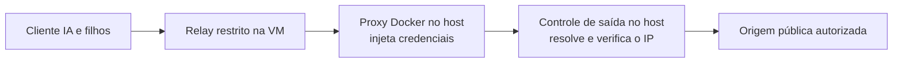

# Desenho aprovado: saída controlada em uma instalação exclusiva

Frente: executor isolado / 2A-R1. Preparada em 2026-10-05 após o pedido “proximo”.
**Estado: modo local exclusivo aprovado pelo mantenedor com “aprovado” em 2026-10-05.**
Nenhum proxy configurado ou componente implementado. O [plano da prova](../plans/2026-10-05-exclusive-egress-proof.md)
está preparado para revisão, mantendo a execução inline já escolhida.
O contrato de segurança continua aprovado; este desenho amplia o alcance operacional.

## Decisão aprovada

O mantenedor aprovou reservar a instalação local do Docker Sandboxes para o YoungCrow
e colocar o controle de destino depois do proxy que injeta credenciais. A primeira
prova usará esta máquina, condicionada ao preflight dos recursos. A alternativa de
runner dedicado permanece disponível se o uso local precisar voltar a ser compartilhado.
Uma segunda conta Windows ou um segundo daemon no mesmo host não têm isolamento comprovado.

| Opção | Alcance e custo | Recomendação |
|---|---|---|
| Docker Sandboxes local exclusivo para YoungCrow | Compartilha a configuração de saída entre as VMs dessa instalação; exige interromper trabalhos próprios durante ativação e retorno | Primeiro caminho, se a instalação puder ser reservada |
| Máquina ou runner dedicado ao YoungCrow | Mesma arquitetura, com ambiente separado dos outros usos de Docker Sandboxes; exige escolher e preparar esse ambiente | Quando a instalação local precisar continuar compartilhada |
| Manter a instalação compartilhada sem mudar seu proxy | Preserva a configuração atual, mas não resolve o requisito de destino final | Perfil isolado continua indisponível |

A primeira opção foi selecionada, aprovando o desenho e esse alcance para a revisão
do plano existente. O plano será revisado antes de escrever código ou ativar o modo.
A escolha de runner dedicado define a arquitetura; não autoriza contratar ou provisionar
um serviço ainda não identificado. Nenhuma opção permite usar credenciais reais nesta prova.

## Por que a configuração precisa de um dono

A [prova anterior](../../relatorios/2026-10-05-hostname-cidr-proof.md) encerrou a hipótese
de controlar o endereço resolvido com CIDRs sobre um domínio permitido. Um relay na
VM, sozinho, deixaria a última resolução fora desse controle.

O [upstream do Docker](https://docs.docker.com/ai/sandboxes/configuration/upstream-proxy/)
é experimental. `proxy.sandbox` abrange o tráfego das sandboxes; `proxy.daemon` tem
outro escopo. Existem exclusões `no_proxy`, precedência de ambiente e opções de saída
direta. Proxies existentes adotam mudanças após reinício do daemon. SOCKS5h delega a
resolução ao upstream; isso é uma possibilidade documental, ainda sem prova aqui.

Nas interfaces consultadas de Docker Sandboxes 0.46.0, não há seletor de upstream por
VM em [settings set](https://docs.docker.com/reference/cli/sbx/settings/set/) ou
[create](https://docs.docker.com/reference/cli/sbx/create/). A ajuda de
[daemon start](https://docs.docker.com/reference/cli/sbx/daemon/start/) não expõe outra
pasta de estado/socket. Isso descreve as interfaces examinadas, sem afirmar que toda
forma de isolamento do fornecedor foi descartada. [Registro da consulta](../../medicoes/exclusive-egress-review.json).

Configurar, criar uma VM e restaurar imediatamente o valor global não serve como
isolamento permanente: a recriação posterior do proxy pode recuperar a saída anterior.
O modo exclusivo será opt-in, com verificação de propriedade e conflitos. Um lock do
YoungCrow coordena seus processos; não impede outra aplicação de usar o Docker.

## Caminho proposto e fronteiras

O cliente continua sem acesso ao proxy genérico do Docker, ao host, ao MCP e à rede
privada. Um relay fora do processo e das permissões do cliente reconstrói pedidos
somente para a origem autorizada, fixa Host/SNI e recusa destinos divergentes e
redirecionamentos. O [requisito MCP aprovado](2026-10-04-mcp-boundary-decision.md)
permanece: o gateway pode existir no gerenciador, mas o cliente e seus descendentes
não podem alcançá-lo. A existência de upstream não comprova essa fronteira.

Depois da injeção, o controle de saída deve receber o domínio exato autorizado,
validar a resolução inteira e abrir o socket pelo endereço numérico verificado.
Não pode resolver novamente no momento de conectar, seguir outro proxy ou escolher
um destino fora do conjunto validado. Antes de retransmitir bytes, deve comparar o
peer do socket ao endereço aceito. Cada nova conexão repete a validação.

São recusados endereços privados, loopback, link-local, metadata, multicast,
reservados e endereços do próprio host/gateway, inclusive suas representações IPv6.
Resposta DNS que mistura endereço permitido e proibido é recusada integralmente.
Porta, identidade, limite de conexões e prazo pertencem à operação autorizada. DNS
consulta apenas o resolvedor confiável declarado; isso não libera destinos pedidos
pelo workload. Caminhos IPv4/IPv6 precisam de prova própria ou negação explícita.

O componente de saída pode transportar TLS sem nova interceptação; a validação da
identidade do fornecedor e a injeção continuam com o Docker. Ainda precisamos medir
se ele encaminha domínio, se preserva a injeção e se evita fallback direto. Não se
escolheu biblioteca ou serviço: primeiro avaliar um componente existente que cumpra
esses requisitos; escrever apenas o que faltar. Não haverá novo gerenciador de OAuth.

Este modo não muda a configuração de proxy do Windows, do Docker Desktop ou do
tráfego do daemon. Também não promete proteger contra administrador hostil do host.
O alcance novo é a saída das VMs do Docker Sandboxes reservado. Não chamar isso de
configuração exclusiva de um repositório quando ela afeta a instalação inteira.

## Ativação e retorno

1. Antes de qualquer escrita, conferir versão, identidade das VMs, ausência de
   trabalhos ativos e inventário de consumidores. VM desconhecida ou propriedade
   ambígua impede ativação; não parar nem adotar recursos de terceiros.
2. Persistir valores explícitos anteriores, origem dos valores efetivos e intenção
   de alteração em recibo local protegido. URLs de proxy podem conter segredos:
   nunca imprimi-las ou copiá-las ao relatório público. Override de ambiente não
   explicado ou exclusão que permita desvio impede a ativação.
3. Iniciar o controle em endereço local, com identidade e acesso restritos. Alterar
   somente `proxy.sandbox` e as exclusões necessárias desse escopo. Não alterar o
   proxy genérico, `proxy.daemon`, ambiente global ou proxy do sistema. Conflito que
   exija ampliar esse conjunto volta para decisão.
4. Recriar os proxies por um único reinício planejado do serviço, com as VMs paradas.
   Verificar o caminho efetivo antes de admitir qualquer trabalho. Dada a falha de
   sockets já observada neste terminal, preparar o comando para o terminal normal
   do operador se essa limitação continuar; não repetir reinícios às cegas.
5. Falha do componente, mudança de configuração, consumidor inesperado ou identidade
   divergente bloqueia novos despachos e interrompe os próprios trabalhos pelo prazo
   persistido. O monitor não substitui a negação de fallback no caminho de rede.
6. Para desativar, bloquear admissões, encerrar os trabalhos próprios e confirmar
   parada antes de restaurar valores. Restaurar somente o que este modo alterou e
   somente se ainda corresponder ao valor aplicado; preservar alterações de terceiros
   e registrar conflito. Recriar os proxies, conferir o retorno e fechar o componente.

Cada fase tem intenção durável e reconciliação após queda. `finally` ajuda na limpeza,
mas não prova recuperação após processo morto. Enquanto a restauração não puder ser
confirmada, o YoungCrow permanece bloqueado e informa os recursos ainda afetados.
Nenhum backup de credencial será publicado ou reaproveitado como autorização.

## Prova mínima antes de integrar

Aprovar o desenho não certifica o perfil. A próxima entrega deve produzir uma prova
descartável, seguida de revisão do resultado; não integrar o relay ao produto por
ter passado numa fixture. Manter `REVIEWED_PROFILES = ()`.

| Etapa | Evidência exigida | Falha que encerra a hipótese |
|---|---|---|
| Contrato local | DNS variável/misto, endereço privado, Host/SNI divergente, redirect, identidade TLS inválida e componente indisponível têm recusas atribuíveis; nenhuma conexão proibida | Só timeout/ausência de resposta, ou conexão antes de validar o destino |
| Compatibilidade nativa | Docker real encaminha domínio ao controle, injeta só credencial fictícia, TLS valida a origem e o recibo liga operação/domínio/IP/peer | Perda da injeção, IP sem identidade vinculada ou caminho alternativo |
| Queda e retorno | Componente desligado impede saída, prazo original vale, recuperação não repete despacho, configuração/inventários retornam ao estado registrado | Saída direta, operação duplicada, prazo estendido ou limpeza não comprovada |

Começar por uma operação de diagnóstico por vez para atribuir as conexões sem
ambiguidade. Isso não altera o limite planejado de três PBIs e três agentes no produto.
O ensaio nativo tem até três tentativas de eco novas: caminho disponível, componente
indisponível, caminho recuperado. Uma GET por tentativa, sem retry/redirect, dez
segundos por tentativa e 120 segundos para o ensaio; preparação e limpeza têm prazos
separados no plano. Usar somente um valor fictício descartável no domínio de eco já
medido. Não consultar modelos, instalar certificados ou alcançar serviços privados
reais. Casos de DNS privado/rebinding usam fixtures e sentinelas controladas.

Registrar apenas decisão, domínio, IP/peer, tempos, identidade e hashes necessários;
descartar corpos e cabeçalhos que possam conter valores injetados. A indisponibilidade
precisa ser atribuída ao caminho controlado, com controles positivos antes/depois.
Erro genérico é inconclusivo. Se o Docker ignorar o upstream, perder a injeção ou
fizer fallback, encerrar o candidato e reportar; não afrouxar o guard, ampliar domínios
ou iniciar ciclos adicionais automaticamente.

Mesmo com essa prova aprovada, ainda faltam isolamento do relay contra o cliente,
rede/MCP sob o caminho autenticado, pacote reconstruído, suspensão do host e os
clientes reais. São pendências de R1/R3, não novas features. R2/R3 continuam sem início.

## English overview

**Exclusive local scope approved; implementation plan awaiting review. No proxy change.**
The maintainer selected this machine's Docker Sandboxes installation for exclusive
YoungCrow use, subject to preflight. A dedicated runner remains an alternative if
local use must become shared. No separate
Windows account/second daemon isolation is assumed. A runner has not been selected.

The previous native CIDR candidate was rejected. The proposed path is an isolated
origin relay, Docker's host-held credential injection, then a final-address guard.
The guard must validate DNS results, connect to a checked numeric address and compare
the socket peer before relaying data. Private/host/MCP destinations, redirects and
direct fallback remain forbidden. Docker upstream compatibility is untested; its
public interfaces inspected here expose an installation-wide sandbox setting.

Choosing exclusive local use approves the design and operational scope for an update
to the existing plan, reviewed before implementation. Reject unknown consumers
and unexplained environment overrides. Preserve protected original settings, change
only sandbox-scoped proxy/exclusions, recreate proxies with a planned service restart
and verify the effective route. Teardown stops owned work before restoring settings;
conflicting third-party edits must be preserved and reported. Crash recovery requires
durable reconciliation. Do not change OS, Docker Desktop or daemon-traffic proxies.

Use local negative fixtures followed by at most three native echo attempts with one
dummy credential: guard available, unavailable, recovered. Ten seconds per attempt,
120 seconds for the probe, separately bounded preparation/cleanup; no retries, real
tokens, model calls, certificate installation or real private-service requests.
Generic errors cannot establish safety. End the candidate if upstream routing,
injection or fail-closed behavior fails. A successful probe still leaves relay
isolation, authenticated MCP exclusion, rebuilt packaging, host suspension and real
clients unverified. Profiles remain empty, R1 partial, R2/R3 not started.

ATRASO: main 1
