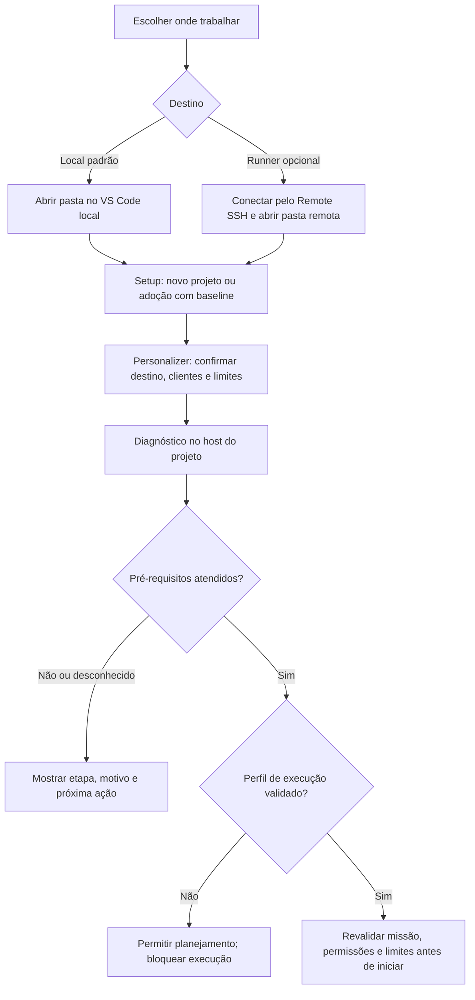

# Setup local e runner dedicado

Frente: executor isolado / YC-203. Desenho técnico aprovado em 2026-10-05.

A [decisão de produto](2026-10-05-local-and-dedicated-execution.md) mantém execução local
por padrão e runner dedicado opcional, com Claude Code e Codex. O pedido “bora” autoriza
detalhar essa experiência. O mantenedor aprovou este desenho, incluindo Remote SSH,
com “aprovado”. O
[plano de implementação](../plans/2026-10-05-execution-setup.md) foi confirmado; as interfaces
estão implementadas nesta branch e foram verificadas em adoção e regressão.
O [relatório](../../relatorios/2026-10-05-execution-setup.md) registra escopo e limites.

## Resultado e escopo

Quem adota o YoungCrow deve saber onde os agentes executarão, quais dependências faltam
e por que uma missão está bloqueada. Setup concluído significa que os arquivos foram
instalados. Preparação do ambiente e aceite de execução são resultados separados.

O incremento prepara a seleção, o diagnóstico e o roteiro de uso nas duas opções.
Não encerra R1 nem implementa antecipadamente fila, execução persistente ou transferência.
Essas entregas continuam no [backlog](../../BACKLOG.md). O ciclo nativo v2 permanece fechado.

## Acesso ao runner

| Alternativa | Efeito no produto | Proposta |
|---|---|---|
| Abrir o projeto remoto pelo VS Code Remote SSH | O mesmo harness roda no host do projeto; o VS Code fornece acesso ao diretório e ao terminal | Caminho inicial recomendado |
| Despachar do checkout local para um serviço remoto | Exige serviço, protocolo de envio, autenticação, sincronização e recuperação entre hosts | Ampliação posterior, se solicitada |

O [Remote SSH](https://code.visualstudio.com/docs/remote/ssh) abre pastas remotas e
executa comandos e extensões naquele ambiente. Ele instala o VS Code Server no host
remoto. O usuário prepara e verifica seu acesso SSH fora do harness. O YoungCrow não
instala um servidor SSH nem altera chaves, firewall ou configuração global.

No caminho recomendado, repositório, coordenador, SQLite e vault ficam no host aberto
no VS Code. Claude Code/Codex são instalados e autenticados nesse host pelos mecanismos
oficiais. Login no desktop não comprova login remoto. O terminal dos clientes é o caminho
básico; cada extensão de editor precisa de sua própria verificação de compatibilidade.

O SSH é acesso do operador ao host do coordenador. O processo do agente continua dentro
da sandbox, sem chaves, agent forwarding, socket SSH ou acesso ao serviço SSH do host.
Os controles `ssh=False` e `remote_control=False` do executor continuam exigidos.

Fechar o editor não concede persistência ao processo. A execução de servidor independente
da conexão exige o supervisor e a recuperação previstos na esteira. Queda de conexão
leva à consulta dos recibos; não reenvia uma operação nem migra automaticamente a missão.

## Fluxo do usuário

Novo projeto e migração usam o setup existente. Quem escolheu adoção reversível obtém
baseline antes de qualquer registro do destino. A migração preserva código, configurações
e respostas anteriores. O Personalizer consulta o perfil/entrevista e só pergunta o que
falta: destino, cliente por papel, modelo, effort e limites já seguem as decisões existentes.

Para começar uma missão nova no runner, preparar o projeto naquele host é suficiente
como fluxo de adoção; isso não transfere uma missão em andamento. A transferência
local/servidor exige YC-208/209: origem pausada e reconciliada, pacote privado, importação
pausada, autenticação própria e um único responsável. Git sozinho não transporta o vault
privado. A restauração da adoção de cada host continua separada da transferência de missão.

## Seleção e interfaces

A preferência pertence à instalação, em `.operacao-local/execution/selection.json`,
ignorada pelo Git e protegida pelos helpers de armazenamento privado. O registro contém
somente `schema_version: 1`, `location: local|dedicated` e `selected_at` em UTC.
Não contém endereço, chave, token ou autorização de execução. A ausência do arquivo produz
o padrão `local` sem escrita; o relatório distingue origem `default` de `configured`.

| Interface | Contrato |
|---|---|
| `setup.sh PASTA --execution-location local\|dedicated` | Sem registro anterior, grava a escolha após a proteção de adoção. Sem flag, usa o padrão local. Registro existente é preservado; uma flag divergente recusa antes da instalação |
| `missions.py environment show --json` | Consulta preferência e digest; ausência retorna o padrão. Não cria diretório, lock, banco ou nota |
| `missions.py environment configure --location local\|dedicated --expected-digest VALOR --json` | Grava somente a preferência, com comparação e troca sob exclusão mútua. `none` vale apenas para arquivo ausente; repetição com o digest atual é idempotente |
| `missions.py client environment --executable CAMINHO --json` | Reutiliza o diagnóstico existente; acrescenta a preferência e observações por etapa. Não conecta a outro host e não habilita um perfil |

Os nomes acima definem as interfaces implementadas nesta branch. `local` e `dedicated` identificam a
intenção do operador; nenhuma opção faz o harness sair do host onde o comando foi aberto.
No runner, executar o comando no terminal remoto. Variáveis SSH ou do editor podem ajudar
a apresentar contexto, mas nunca comprovam identidade, isolamento ou autorização.

Trocar a preferência não altera missão, geração responsável, limites ou recibos existentes.
Não há substituição automática por missão nesta entrega: mover uma missão continua sendo
transferência explícita. `youngcrow/agents.json` conserva seu esquema e suas substituições
de modelo/effort. A nota do Personalizer referencia a escolha; o JSON é a preferência
operacional, e o perfil em Markdown não funciona como autorização.

O setup distribui os mesmos helpers para ambos os clientes, sem um instalador por destino.
A opção precisa atravessar o wrapper de adoção e seu processo filho. `--force` preserva
seleção, helpers modificados e configurações existentes. Esquema desconhecido ou caminho
com symlink/junction é recusado; conflito não é corrigido apagando arquivos.

## Diagnóstico e mensagens

Separar `setup_installed`, lacunas de pré-requisitos e `runtime_profile_unverified` na
apresentação. Com os perfis atualmente vazios, nenhuma opção pode anunciar execução pronta.
O diagnóstico conserva `gaps`, identidade observada e campos existentes, com novos dados
aditivos: destino declarado, origem da preferência e uma lista de etapas sanitizadas.

Cada etapa informa identificador fixo, início/fim em UTC, duração monotônica, limite,
resultado `observed|missing|unsupported|failed|timeout|not_checked` e código de motivo.
Exemplos de identificador: `host_metadata`, `virtualization`, `runtime_identity` e
`sandbox_inventory`. Não copiar ambiente, linha de comando arbitrária, stdout bruto,
tokens ou caminhos privados para as mensagens. Uma falha informa a etapa conhecida;
nunca transforma timeout em prova de bloqueio de rede.

Manter o limite atual de 30 segundos por consulta e 8 MiB de saída. Os dados das etapas
devem ser produzidos pelo processo que impõe o prazo, antes de traduzir o erro em uma
mensagem genérica. Não aumentar timeout nem adicionar retry para mascarar a falha.
Etapas independentes podem ser observadas dentro dos limites; etapas dependentes ficam
`not_checked` quando faltar uma precondição. O relatório é devolvido, sem gravação automática.

O diagnóstico observa SO/arquitetura, virtualização, executável e versão do runtime.
Inventário de sandbox continua opt-in via `--sandbox`, sem iniciar VM. Catálogo/modelos
e autenticação continuam nas interfaces dos clientes; não disparar login ou inferência
como efeito do setup. Uma dependência ausente gera instrução, sem instalação ou reinício
automático. O modo dedicado executa as mesmas verificações no host remoto.

O código atual contempla diagnóstico em Windows 11 x64 e Ubuntu 24.04 x64 com KVM.
O [fornecedor anuncia outras combinações](https://docs.docker.com/ai/sandboxes/install/);
isso não amplia a matriz YoungCrow. Nenhuma plataforma tem perfil de execução certificado.
Dev Container é opcional para dependências e não satisfaz o gate de isolamento por si só.
O backend candidato continua sendo `sbx`, já em validação. A seleção do destino não
introduz outro backend nem substitui a prova pendente por uma execução no servidor.

## Organização da entrega

Estes três PBIs refinam a preparação de YC-203; não substituem os três PBIs R1/R2/R3
do executor nem alteram a contagem principal do produto.

| PBI | Arquivos/fluxo afetados | Aceite |
|---|---|---|
| Seleção persistente | `setup.sh`, adoção, CLI de missões e helpers de configuração | Padrão local, runner explícito, configuração privada, conflito preservado e retorno ao baseline |
| Diagnóstico atribuível | `mission_sandbox.py`, transporte de consultas e CLI existente | Falha/timeout aponta etapa e limite; consulta não escreve nem inicia recursos; perfil vazio continua bloqueando |
| Adoção nos dois destinos | Personalizer, guia instalado, README/USAGE PT/EN e testes de instalação | Novo/migrado e Claude/Codex recebem o fluxo correto; comandos propostos só viram instruções operacionais após implementação |

Reutilizar helpers de privacidade, caminhos seguros, gravação atômica, supervisão e
diagnóstico; qualquer módulo novo deve ter uma responsabilidade que os existentes não
atendam. Não criar serviço HTTP, banco remoto, SDK de modelo ou sincronizador.

## Verificação e retorno

Testes de contrato cobrem preferência ausente/inválida, preservação na reinstalação,
digest concorrente, permissões, paths redirecionados e restauração após trial. Um processo
substituto que excede o prazo valida o diagnóstico de timeout sem chamar Docker ou modelos.
Fixtures Windows/Linux verificam classificação; não certificam execução nativa.

A matriz de adoção cobre novo/migração × Claude/Codex × local/dedicado. Nos testes dessa
entrega, `dedicated` é uma seleção de configuração. O aceite em um host remoto real,
autenticação e persistência do executor continuam pendentes de ambiente e prova próprios.
Testes também conferem que mudança de preferência não muda recibos de missões existentes.

Verificar instalação em cópia descartável e restauração de trial; conferir navegação do
vault, links, comandos instalados e preservação do design do README. Para voltar desta
configuração, restaurar a preferência sob o digest atual ou usar a adoção reversível.
Isso não interrompe nem transfere uma missão; seu encerramento continua com o executor.

## Estado da proposta

O desenho foi conferido contra o setup, configuração dos agentes, preflight, adoção e
contrato de transferência existentes. SSH foi consultado na documentação oficial e
convertido pelo Docling para o vault privado. Nenhum servidor foi contatado para execução,
nenhum pacote foi instalado e nenhuma prova Docker foi reaberta.

Matriz de adoção e regressão concluídas; achado da revisão independente corrigido.
Próximo: delimitar a prova pendente de isolamento/rede, sem reabrir o ciclo v2 automaticamente. A rodada de segurança
continua com R1 parcial, R2/R3 pendentes e perfis vazios; a escolha do destino não altera isso.

## English overview

This technical proposal keeps local execution as the default and an optional dedicated
runner. The recommended first access path is VS Code Remote SSH: the existing harness,
workspace and state stay on the selected host, with separate native client authentication.
The operator's SSH access does not grant sandboxed agents access to host keys or services.

The implementation adds a private installation preference, setup/CLI selection and phase-specific
read-only diagnostics, followed by adoption coverage for both clients and locations. A
configured location never certifies isolation, transfers an active mission or guarantees
background execution. Existing ownership, supervisor and transfer requirements still apply.
The previous native probe remains closed. The maintainer approved this design, including
Remote SSH. The plan was confirmed; interfaces are implemented and locally validated on this
branch. See the delivery report for evidence and remaining native-runtime limitations.
